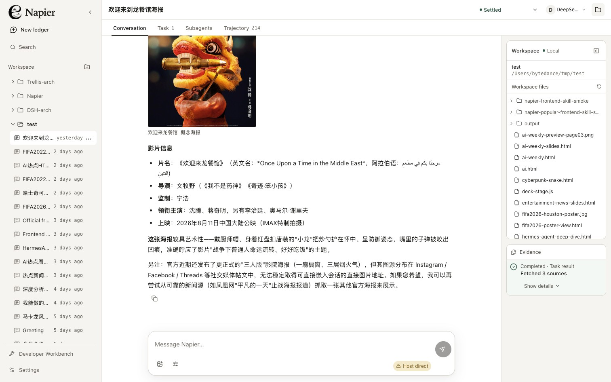
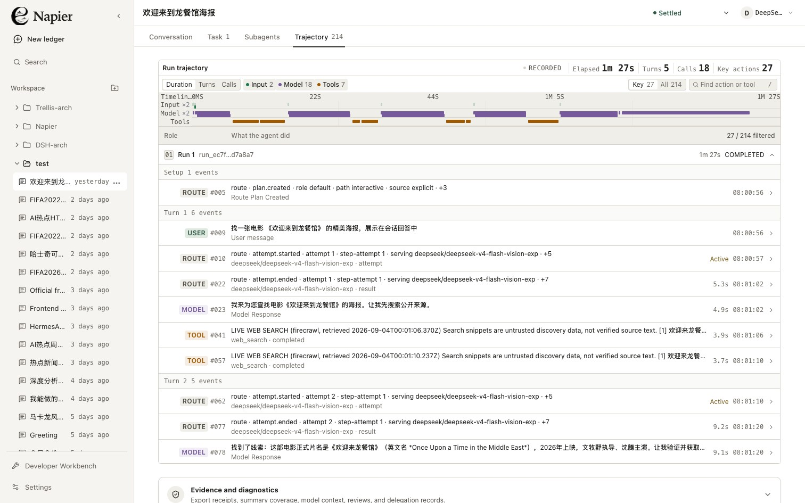

<div align="center">

# Napier

**A local-first, glass-box agent workbench built around a replayable evidence ledger.**

Run long-horizon tasks, watch meaningful progress as it happens, inspect every
recorded action, and continue the work without losing the thread.

[](./package.json)
[](https://nodejs.org/)
[](https://www.typescriptlang.org/)
[](#data-safety-and-privacy)
[](./LICENSE)

[Quick start](#quick-start) · [Workbench](#the-workbench) ·
[CLI](#cli-and-other-interfaces) · [Architecture](#architecture) ·
[Development](#development) · [Documentation](#documentation)

</div>

<p align="center">
  
</p>

<p align="center"><sub>Desktop workbench · deterministic local fixture · no external model required</sub></p>

## Why Napier

Most agent products treat chat as the source of truth and attach tasks, traces,
and artifacts afterward. Napier starts from a different primitive:

> **Chat is a projection of the work ledger.** Messages, model calls, tool
> activity, plans, approvals, artifacts, branches, and runtime decisions share
> one ordered evidence stream.

That makes long-running work inspectable while it is happening and durable
after it stops. A run can be resumed, branched at an exact sequence, replayed,
compared, or evaluated against the same evidence the operator saw.

| See the work                                                                                 | Keep the state                                                                                           | Control the boundary                                                                                                       |
| -------------------------------------------------------------------------------------------- | -------------------------------------------------------------------------------------------------------- | -------------------------------------------------------------------------------------------------------------------------- |
| Stream public progress and provider-visible reasoning without waiting for the final answer.  | Persist threads, runs, goals, plans, artifacts, decisions, and events in an authoritative SQLite ledger. | Scope file access to a workspace, negotiate execution capabilities, and require explicit approval where policy demands it. |
| Inspect a structured timeline, raw event payloads, timings, model routes, and tool outcomes. | Resume interrupted work, branch from a known event, and reconstruct deterministic replay fixtures.       | Keep provider secrets server-side and redact private source content before it reaches durable or live projections.         |

## The workbench

Napier's desktop-first Web workbench keeps the conversation readable while
making the execution model visible.

- **Live execution narrative** — concise phase updates appear between tool
  batches; supported models stream provider-visible reasoning incrementally.
- **Conversation, task, subagent, and trajectory views** — switch from the
  human narrative to structured execution evidence without leaving the thread.
- **Workspace explorer** — choose a local folder with the host's native picker,
  browse a compact file tree, and open linked files or produced artifacts from
  the answer.
- **Artifact inspection** — preview supported workspace outputs beside the
  conversation and retain their verification evidence.
- **Image-aware composer** — attach images for models that advertise vision
  input support.
- **Operator decisions** — pause safely for a bounded choice, record the
  answer, and continue as a linked run.
- **Developer workbench** — inspect model/tool experiments, evaluations,
  Casebooks, provider setup, extensions, and runtime diagnostics.

<p align="center">
  
</p>

<p align="center"><sub>Trajectory view · duration timeline, run grouping, key-action filter, and expandable event detail</sub></p>

## Quick start

### Prerequisites

- Node.js `>=22.19.0`
- npm and Git

### Start the local workbench

```bash
git clone https://github.com/Champ-X/Napier.git
cd Napier
npm install
npm run dev
```

Open [http://127.0.0.1:5173](http://127.0.0.1:5173). The development command
builds the shared Contracts and Runtime first, then watches Contracts, Runtime,
Server, and Web together. Its bootstrap is compilation-only; publishable builds
through `npm run build` retain the fail-closed release source-attestation gate.
The API listens on `127.0.0.1:8787` by default.

The deterministic `napier/demo` model needs no credentials and is enough to
explore the product flow. Configure a live provider for real model work.

### Add a live model

```bash
cp .env.example .env
```

Set one or more supported environment variables in `.env`:

```dotenv
OPENAI_API_KEY=
DEEPSEEK_API_KEY=
ANTHROPIC_API_KEY=
GEMINI_API_KEY=
OPENROUTER_API_KEY=
```

Restart `npm run dev`, then open **Settings → Agent & Model → Evidence** and register the
matching environment reference. Napier persists the reference and status, not
the secret value; the value remains inside the Server process.

## CLI and other interfaces

The Web app, CLI/TUI, HTTP/SSE server, local RPC process, and TypeScript SDK all
sit on the same Runtime and Ledger contracts.

### CLI

```bash
# Diagnose model, browser, network, and sandbox readiness
npm run napier -- doctor --workspace .

# Interactive sessions
npm run napier -- chat --workspace .
npm run napier -- tui --workspace .

# One-shot run
npm run napier -- run --workspace . --prompt "Inspect this project"

# Continue a waiting or interrupted thread
npm run napier -- resume --workspace . --thread <thread-id>

# Execute a typed workflow manifest
npm run napier -- workflow --workspace . --manifest path/to/workflow.json
```

Run `npm run napier -- --help` for branching, capability presets, Browser Use,
read-only experiments, provider setup, plugins, and JSONL streaming options.

### Interface map

| Interface      | Entry point           | Best for                                                                    |
| -------------- | --------------------- | --------------------------------------------------------------------------- |
| Web workbench  | `npm run dev`         | Interactive desktop work, artifacts, approvals, and visual trace inspection |
| CLI / TUI      | `npm run napier -- …` | Terminal-native tasks, recovery, automation, and JSONL consumers            |
| HTTP + SSE     | `apps/server`         | Local integrations and live run streams                                     |
| stdio RPC      | `napier rpc`          | Long-lived JSON-RPC 2.0 embedding                                           |
| TypeScript SDK | `@napier/sdk`         | Store-free typed clients and management integrations                        |

## Architecture

```text
┌──────────────────┐   HTTP / SSE   ┌──────────────────┐
│  Web workbench   │ ─────────────▶ │   Hono server    │
└────────┬─────────┘                └────────┬─────────┘
         │ shared contracts                  │
         │                          ┌────────▼─────────┐
┌────────▼─────────┐                │  Agent Runtime   │
│ @napier/contracts│◀──────────────▶│ policy · tools   │
└──────────────────┘                │ goals · replay   │
                                    └────────┬─────────┘
┌──────────────────┐                         │
│ CLI · TUI · RPC  │ ────────────────────────┤
└──────────────────┘                         ▼
                                    SQLite WAL ledger
```

The Runtime has no HTTP or React dependency. The Web app consumes Contracts,
the Server adapts HTTP/SSE to Runtime operations, and every interactive surface
observes the same ordered events.

### Repository map

| Path                     | Responsibility                                                                                          |
| ------------------------ | ------------------------------------------------------------------------------------------------------- |
| `apps/web`               | Desktop workbench and event projections; depends on Contracts, not Runtime internals                    |
| `apps/server`            | Loopback Hono API, SSE streaming, native workspace selection, and production static host                |
| `apps/cli`               | CLI, TUI, local RPC, recovery, workflows, experiments, and diagnostics                                  |
| `packages/contracts`     | Stable serializable domain, API, and run-event contracts                                                |
| `packages/runtime`       | Agent loop, model routing, policy, tools, goals, memory, subagents, workflows, replay, and SQLite store |
| `packages/sdk`           | Typed store-free embedding and management facade                                                        |
| `packages/benchmark-kit` | Coding, research, browser, workflow, security, UX, and performance benchmarks                           |
| `packages/harness-eval`  | Model-harness experiment and acceptance evaluation support                                              |
| `skills`                 | Bundled Agent Skill packages                                                                            |

### Runtime invariants

1. Durable behavior is recorded before it is presented.
2. Sequence numbers increase strictly within a thread; Run-local claims use
   compare-and-swap against the durable Run frontier.
3. Events that grant future execution authority require an active Run, while
   terminal settlement and audit evidence remain replayable after termination.
4. Tool permission is evaluated immediately before execution; resource-scoped
   concurrency and renewable execution leases ensure one live effect owner.
5. Progress, convergence, and failure circuits derive from each tool's declared
   protocol semantics instead of tool names or research-specific call counts.
6. Provider credentials and host capabilities remain server-side.

## Data, safety, and privacy

> [!IMPORTANT]
> `NAPIER_HOST_DIRECT_SANDBOX=1` explicitly enables commands to run with the
> current user's host authority and **without OS isolation**. Use it only when
> that boundary is intentional; the UI surfaces the mode on every run.

- Runtime data defaults to `<workspace>/.napier`; override it with
  `NAPIER_HOME`.
- Tool paths are canonicalized against `NAPIER_WORKSPACE` (the inferred current
  workspace by default).
- Process capabilities are negotiated at startup. If no supported sandbox is
  ready, Napier can degrade the tool surface instead of silently claiming
  isolation.
- `ledger.sqlite` is authoritative and uses SQLite WAL. `workspace.json` and
  `events/*.jsonl` are compatibility projections, not the commit path.
- Provider secret values are never serialized into the Ledger or returned to
  the browser.
- Public progress and provider-visible reasoning may stream live. After a
  private Source is read, model text/reasoning projections fail closed to
  hashes and byte counts; the Raw trace shows the recorded receipt rather than
  leaking the source.
- Operator decisions, browser interaction boundaries, extension trust, and
  tool permissions remain explicit evidence rather than hidden UI state.
- `GET /api/health` reports runtime, SQLite schema, and migration readiness
  without returning workspace content.

## Development

```bash
npm run typecheck          # Type-check every workspace
npm test                   # Root contract tests + workspace suites
npm run build              # Build all packages and applications
npm run check:web-design   # Frontend design-system and boundary checks
npm run check:web-ui-e2e   # Deterministic desktop UI scenarios and layout baseline
npm run check              # Full release gate, including retained artifacts and host checks
```

The architecture gate constrains dependency direction, file size, complexity,
fan-out, public exports, and strongly connected components. Release artifacts
are hash-bound; do not rewrite retained external evidence merely to make a
source-bound check pass.

## Documentation

| Document                                                                                             | What it covers                                                                            |
| ---------------------------------------------------------------------------------------------------- | ----------------------------------------------------------------------------------------- |
| [Architecture](./docs/architecture.md)                                                               | Event contract, persistence, runtime boundaries, safety, replay, and capability reference |
| [Workbench V2 design](./docs/napier-workbench-v2-design.md)                                          | Product model and workbench information architecture                                      |
| [Frontend optimization design](./docs/web-frontend-optimization-design-2026-08-24.zh-CN.md)          | Desktop Web design system, interaction targets, and acceptance criteria                   |
| [Harness optimization design](./docs/agent-harness-optimization-design-2026-08-22.zh-CN.md)          | Model-harness routing and optimization design                                             |
| [Harness acceptance matrix](./docs/agent-harness-optimization-acceptance-matrix-2026-08-23.zh-CN.md) | Evaluation scenarios and evidence expectations                                            |

## Project status

Napier is at version `0.1.0` and under active development. It is currently a
source-run local product rather than a packaged desktop installer; contracts,
release receipts, and advanced administration surfaces may continue to evolve.

<details>
<summary><strong>Inspiration</strong></summary>

Napier is not a fork. It draws ideas from
[Pi](https://github.com/earendil-works/pi),
[LLM Space](https://github.com/deer-flow/llm-space),
[DeerFlow](https://github.com/bytedance/deer-flow),
[Deer Workflow](https://github.com/deerwork-ai/deer-workflow), and
[Oh My Pi](https://github.com/can1357/oh-my-pi).

</details>

## License

Released under the [MIT License](./LICENSE).
