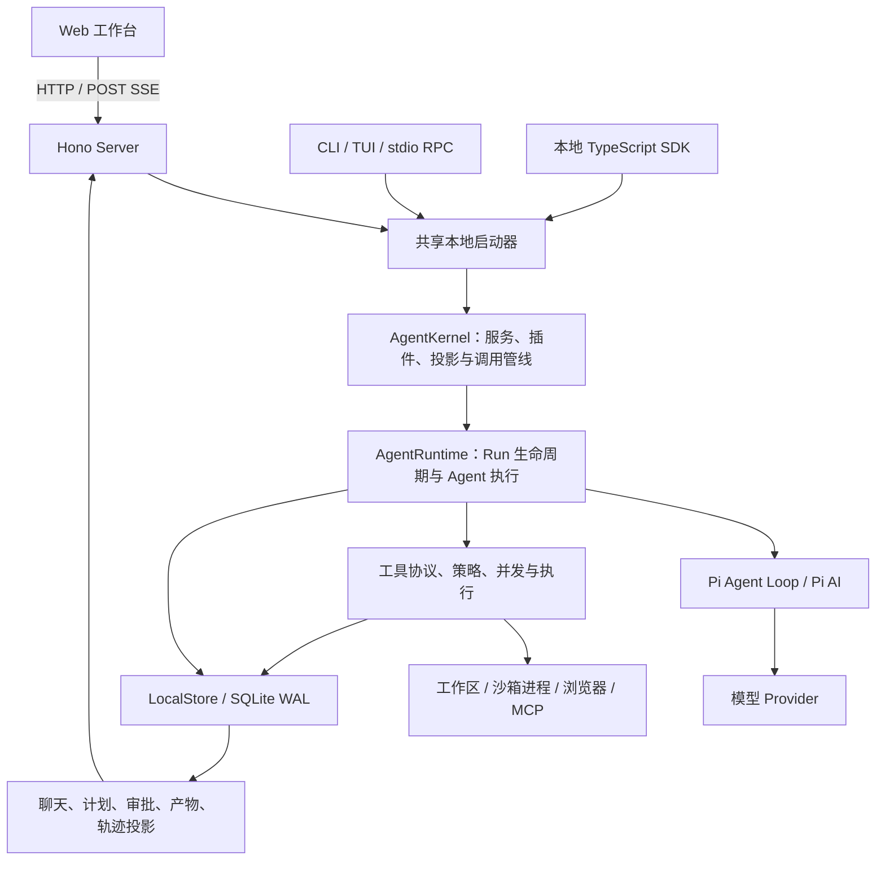
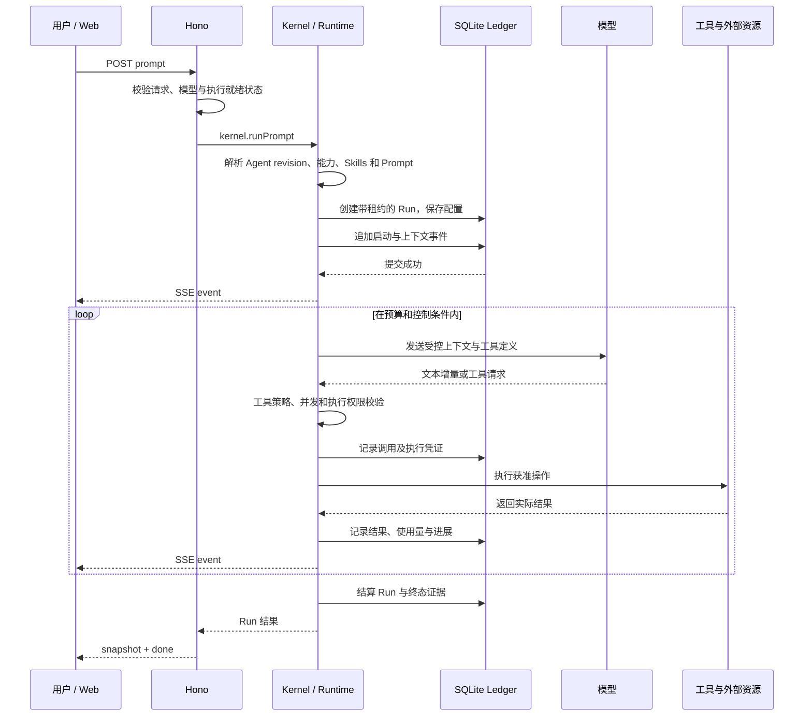

**Napier 项目架构学习指南与面试准备**

核查日期：2026-09-07。基线：本地 HEAD `452a420a` 与当前工作区内容，包含已有未提交改动。本文以本次阅读的源码为依据，区分机制、验证结果和推导出的取舍；不将历史文档中的性能数据视为当前测量结果。

阅读建议：先把第 1～4 部分讲顺，再深入第 5～9 部分，最后用第 16～18 部分进行面试演练。已有的 [早期面试手册](./napier-interview-deep-dive.zh-CN.md) 可作为题库；其中的旧提交号、测试结果和持久化描述需结合本文校准。

**1. 项目解决的是长任务的执行管理问题。**

Napier 是一个本地优先、执行过程可检查的 Agent 工作台。用户可以从 Web、CLI/TUI、RPC 或 SDK 发起任务，模型通过工具读取资料、修改文件、运行验证、操作浏览器或处理数据，系统持续记录执行过程，并支持人工决策、恢复、回放和评估。

假设用户要求“定位项目中的计价错误，修复后运行相关测试并生成说明”。任务中至少存在六类事实：用户要求、模型实际使用的配置、读过的文件、改动产生的副作用、测试结果、最终产物。仅保存一段聊天文本，很难判断某项修改是否真正发生，也难以判断中断后能否再次执行。

Napier 把这些事实组织到按 Thread 排序的 Work Ledger 中。聊天、轨迹、计划、审批和产物面板分别读取同一份执行证据。因此最值得讲的架构主线是：

> 让不确定的模型决策运行在有明确状态、执行权限、证据和恢复边界的系统中。

“本地优先”指 Runtime、工作区和账本主要在本机管理；使用外部模型或联网工具时仍会发生网络调用。“可检查”指记录可见输入输出与执行凭证，不代表能够观察模型未公开的内部推理。

**2. 从部署和依赖两个角度看，项目是 TypeScript Monorepo 中的模块化本地系统。**



这个图表示运行时调用关系。包依赖则由 Contracts 向外提供公共类型，并由架构脚本限制方向。

| 目录                     | 负责什么                                                    | 边界与技术细节                                               |
| ------------------------ | ----------------------------------------------------------- | ------------------------------------------------------------ |
| `packages/contracts`     | Thread、Run、Event、工具协议和 API 数据契约                 | 不依赖其他 Napier 包；是前后端共同语言                       |
| `packages/runtime`       | 启动、Agent、模型、工具、账本、恢复、Workflow、子代理、评估 | Napier 包依赖仅为 Contracts；没有 Hono 或 UI 依赖            |
| `apps/server`            | HTTP 校验、SSE、管理接口、工作区选择、生产静态文件托管      | 将传输请求适配到 Runtime 服务                                |
| `apps/web`               | 工作台、聊天与任务状态、轨迹和产物展示                      | 只依赖 Contracts，不导入 Runtime                             |
| `apps/cli`               | 单次执行、交互命令、TUI、JSONL、stdio JSON-RPC、doctor      | 直接启动本地 Runtime，不要求先运行 HTTP Server               |
| `packages/sdk`           | 对外提供 typed client、执行句柄和管理接口                   | 主入口 `createNapierClient` 创建本地 Runtime；API 隐藏 Store |
| `packages/benchmark-kit` | 编码、研究、浏览器、Workflow、性能等场景评测                | 用任务结果和留存证据检验行为                                 |
| `packages/harness-eval`  | 模型执行策略的实验及验收支持                                | 用于 Harness 的受控比较                                      |
| `skills`                 | 项目随附的任务方法与资源                                    | 与底层可执行工具分开管理                                     |

技术栈是 Node.js、TypeScript strict、npm workspaces、Hono、SQLite、Vite、React 风格组件、Vitest，以及 Pi Agent/AI 依赖。浏览器能力使用 `playwright-core`；代码智能还接入 TypeScript Language Server、LSP、AST 和 Node 调试协议。

前端有一个容易被忽略的实现细节：[Vite 配置](../apps/web/vite.config.ts) 将 `react`、`react-dom` 和 JSX runtime 映射到 `preact/compat`。准确说法是“使用 React 编程模型，并在当前 Vite 构建中采用 Preact 兼容运行时”。

项目没有把各业务域分别部署成微服务。多包主要用于依赖隔离、接口复用和工程治理，并不自动形成分布式系统。

源码入口：[Server 组合根](../apps/server/src/server-composition-root.ts)、[共享启动器](../packages/runtime/src/local-agent-runtime.ts)、[SDK 入口](../packages/sdk/src/index.ts)。

**3. 先分清 Thread、Run、Turn 和 Tool Call，后面的机制才容易理解。**

| 概念                  | 含义                           | 举例                                          |
| --------------------- | ------------------------------ | --------------------------------------------- |
| Workspace             | 文件访问和本地运行数据的范围   | 当前项目目录与其 `.napier` 数据               |
| AgentProfile          | Agent 的角色及配置             | 模型、System Prompt、工具、Skills、预算和策略 |
| AgentProfileRevision  | 某一版本的 Agent 配置          | 配置修改后产生新的 revision，保留历史         |
| Thread                | 长期任务及其证据容器           | “修复计价问题”这一完整工作线程                |
| Run                   | 一次具体执行尝试               | 用户首次提交、一次恢复、Workflow 节点执行     |
| Turn                  | Run 内模型与工具的一轮交互     | 模型请求读文件，工具结果进入下一轮            |
| Tool Call / Operation | 一项具体工具调用及其受控执行   | 读取文件或提交修改                            |
| RunEvent              | 执行事实的有序记录             | `run.started`、`tool.completed`、审批请求等   |
| Goal                  | 任务完成条件及继续执行约束     | 修复缺陷并提供测试证据                        |
| ExecutionPlan         | 步骤、依赖和状态组成的任务计划 | 定位 → 修复 → 验证 → 交付                     |
| Artifact              | 交付物及其元数据、验证证据     | 文件、报告、数据或目录清单                    |

一个 Thread 有多个 Run；一个 Run 可以经历多个 Turn；一个 Turn 可以包含多个工具调用。Thread 不是操作系统线程，Run 也不是单次 HTTP 请求或单次模型调用的同义词。

Run 的 `status` 表示执行生命周期：`queued / running / completed / failed / cancelled / interrupted`。另有 `outcome` 表达结果，例如 `partial`、`paused_budget`、`blocked_capability`。因此，“本次执行结束”不等于“整个用户目标完成”。

审批是很好的例子：原 Run 可以结算为 completed，而 Thread 进入 waiting，等待用户选择后再创建关联的新 Run。

Run 启动时保存配置指纹，绑定 Agent revision、模型、工具和 Skills、Prompt 哈希、预算等信息。实际模型调用另有上下文和路由凭证，因此能够区分“Run 采用的配置基线”与“某次请求真正使用的模型和上下文”。

配置哈希用于识别漂移，并不把文件、网站或模型服务一起冻结。数据库中的 Run 状态仍会变化；导出的内容寻址快照与运行中的 Run Record 也不是同一对象。

源码：[核心运行契约](../packages/contracts/src/execution-runs.ts)、[Thread 与 Revision](../packages/contracts/src/agent-thread-control-v1.ts)、[事件契约](../packages/contracts/src/run-event-v1.ts)。

**4. 一次用户请求可以沿一条主链讲清楚。**



这里有几处需要展开说明。

启动阶段先选择有效 Agent 配置，再协商当前机器实际具备的执行能力。没有可用沙箱时，某些执行模式会缩减工具能力，运行凭证中记录降级情况。随后加载 Skills 的目录或快照，解析日期等 Prompt 变量，创建 Run 和租约。

运行阶段由 `AgentRuntime.runPrompt` 管理生命周期，`runLive` 准备历史、Memory、工具和系统提示，再调用 Pi 提供的 `runAgentLoop`。Napier 复用了模型/Agent 基础库，自身主要实现外围的持久化、能力治理、上下文、控制、工具执行和产品投影。

模型请求工具时，执行策略在调用前再次校验。工具结果进入后续模型上下文，同时留下独立的执行证据。模型 delta 经过批处理后持久化再推送，避免每个 token 都执行一次完整存储操作。

正常结束时，终态事件可以和 Run 状态在同一持久化边界提交。Server 随后发送完整 snapshot 和绑定它的 done 帧。前端会验证帧身份、顺序、数量与哈希。

最能概括执行顺序的代码位于 `AgentRuntime.record`：

```ts
const event = await this.store.appendEvent(input);
await this.emitRecordedEvent(event, onEvent);
```

观察者回调失败会被隔离，因此浏览器连接断开不直接取消后台任务。这不等于进程崩溃后还能保持同一段 JS 调用栈；那属于恢复机制。

源码：[HTTP 执行入口](../apps/server/src/thread-execution-http.ts)、[Kernel](../packages/runtime/src/agent-kernel.ts)、[AgentRuntime](../packages/runtime/src/agent-runtime.ts)、[delta 批处理](../packages/runtime/src/model-delta-batcher.ts)。

**5. Ledger 的持久化是状态快照与追加事件结合的架构。**

权威数据位于 `ledger.sqlite`。其中 `workspace_state` 保存带 revision 的状态 JSON，`ledger_events` 保存按 Thread 排序的事件；Run 租约、工具并发租约和事件幂等索引有独立表。当前源码的数据库 schema version 为 7。

`workspace.json` 与 `events/<threadId>.jsonl` 是兼容投影，不能将它们描述成与 SQLite 平等的两个事实源。它们允许在 checkpoint 前落后，重启后依据 SQLite 恢复。

SQLite 配置包括 WAL、`synchronous=FULL`、`busy_timeout=5000` 和完整性检查。WAL 允许读者与写者更好地并行，但 SQLite 同一时刻仍只有一个写事务。

当前存在三种重要写入路径：

| 写入路径     | 更新什么                                             | 为什么这样做                           |
| ------------ | ---------------------------------------------------- | -------------------------------------- |
| 完整状态提交 | 状态 JSON、snapshot revision、相关新事件及租约同步   | 保持领域变更与对应记录一致             |
| 普通事件提交 | 插入一个事件，推进数据库 revision，保留旧 state JSON | 避免每个流式事件都序列化完整工作区状态 |
| Run 租约心跳 | 更新精确的 Run lease 行                              | 避免心跳引发整份状态和兼容文件写入     |

完整提交与事件提交使用 `BEGIN IMMEDIATE`，检查预期数据库 revision，再写入并提交；冲突时刷新状态并进行有界重试。事件还有 `(thread_id, seq)` 主键和唯一 event ID 约束。

假设完整快照位于 revision 100，随后发生两次普通事件提交，数据库 revision 变为 102，而 snapshot revision 仍为 100。重启读取快照后，需要重放这两条事件对 Thread 摘要的影响。代码检查尾部事件数量等于 revision 差值，并检查每个 Thread 的序号连续性。缺失或伪造的尾部会使恢复失败。

该尾部重放主要更新 `eventCount`、`updatedAt` 和消息预览。不能由此声称所有领域状态都可仅凭事件从空数据库重建。

兼容文件在状态变更、Turn 或终态边界、固定事件间隔和显式 flush 等时机更新。已有 JSONL 会校验尾部后追加，减少全文件重写。

面试中可以说“具有事件驱动读模型和 CQRS 思路”，但要补充：这是共享数据库上的混合实现，没有独立消息总线，也不是严格意义上的全量 Event Sourcing。

源码：[SQLite 提交](../packages/runtime/src/sqlite-ledger.ts)、[schema](../packages/runtime/src/sqlite-ledger-schema.ts)、[事件服务](../packages/runtime/src/store-event-service.ts)、[Thread 尾部重放](../packages/runtime/src/store-thread-summary-projection.ts)、[兼容投影](../packages/runtime/src/store-compatibility-projections.ts)。

**6. 并发正确性需要区分四种不同的约束。**

第一种是数据库状态 revision CAS。两个 Store 都从 revision 10 开始修改，先提交者推进到 11，后提交者必须刷新并重新计算，避免旧状态覆盖新状态。

第二种是 Thread seq。它为这个 Thread 的所有事件提供顺序，即使其中有不同 Run 的记录。一个 Run 的事件可以对应 Thread 中的 10、12、15；这些间隔不说明 Run 丢了数据。

第三种是事件幂等。相同 `threadId + runId + namespace + key` 只能对应一条事件。它解决重复提交，不等价于外部工具只执行一次。

第四种是 Run 事件头 CAS。假设控制器在 Run 的最新事件序号 15 上计算出“没有进展，应该停止”，但随后出现序号 16 的有效产物证据，旧控制决策不能直接提交。带 `expectedRunHeadSeq` 的追加将检测这种过期判断，触发重算。

因此，数据库 revision 解决状态竞争，Thread seq 解决历史排序，幂等键解决重复提交，Run 事件头解决基于旧历史生成新控制决策的问题。它们不能互相替代。

Run 终态也不是“一律禁止追加任何事件”。授权未来执行的事件需要 active Run；审批延续绑定、终态结算和事后审计仍可能合法写入。按事件语义限制权限，比单一的“终态后拒绝所有写入”准确。

源码：[事件写入器](../packages/runtime/src/run-event-writer.ts)、[事件准入](../packages/runtime/src/run-event-admission.ts)、[幂等测试](../packages/runtime/test/store-event-idempotency.test.ts)、[准入测试](../packages/runtime/test/run-event-admission.test.ts)。

**7. 工具系统同时解决能力发现、权限、并发和副作用。**

工具定义包含输入和输出 schema，但当前的 Tool Protocol 还声明了更多运行语义：

| 声明          | Runtime 用途                                 |
| ------------- | -------------------------------------------- |
| `sideEffect`  | 区分 none、reversible、irreversible、unknown |
| `concurrency` | 声明 safe、serialized、exclusive             |
| `retry`       | 控制何时允许重试、最多重试几次               |
| `idempotency` | 指定参数或预览 token 等身份及结果复用策略    |
| `approval`    | 定义审批方式及代码桥接边界                   |
| `progress`    | 区分获取信息、观察、修改、验证、协调等贡献   |
| `failure`     | 声明错误类别、影响范围、下一步处理方向       |

同一工具还区分 canonical output、model-visible output 和 UI projection。完整内部结果、送入模型的内容、呈现给用户的内容有不同用途，不必完全相同。

能力配置不等于每一轮都把全部工具 schema 发给模型。系统能按模型和任务阶段选择当前工具集，并通过 `capability` 等机制发现其他已配置能力。隐藏 schema 是控制上下文大小的方法，不构成新的授权。

工具策略主要有 observe、workspace、unrestricted 三档。observe 限制工作区副作用，但仍可能允许记录计划等内部状态，因此不能解释成“整个系统零写入”。unrestricted 也不代表没有路径、工具实现或操作系统边界。

执行前还会检查当前轮是否暴露该工具、预算是否耗尽、是否命中重复调用保护，以及扩展信任或浏览器确认是否仍有效。部分工具有独立策略适配；协议驱动不意味着代码中已完全没有基于工具名称的兼容逻辑。

并发控制按资源范围仲裁，避免将所有工具串行化。它有内存队列与持久租约，并通过 AsyncLocalStorage 传播嵌套操作的租约上下文，禁止持有较弱权限的嵌套调用自行升级权限。工具执行另有 operation 身份和 lease generation，过期持有者不能继续获得新的执行授权。

租约到期不能证明已经发出的系统调用或网络请求停止了。代码用持久副作用边界约束 Run 结算，并显式记录 `effect_indeterminate`。因此应描述成“有租约约束和未知副作用处理的执行协议”，而不是“任意副作用 exactly-once”。

源码：[Tool Protocol](../packages/contracts/src/tool-protocol.ts)、[调用前检查](../packages/runtime/src/agent-tool-preflight.ts)、[策略检查](../packages/runtime/src/agent-tool-policy-preflight.ts)、[并发门控](../packages/runtime/src/tool-concurrency-gate.ts)、[持久协调器](../packages/runtime/src/tool-concurrency-durable-coordinator.ts)、[副作用权限约束](../packages/runtime/src/sqlite-tool-effect-authority.ts)。

**8. 文件修改的安全性来自具体的校验与提交顺序。**

以修改源文件为例，模型先读取内容和文件哈希，生成带预期哈希的变更。执行阶段重新读取并比较；如果用户或另一个执行者已经改了文件，操作拒绝覆盖，要求基于新内容生成修改。

路径检查覆盖工作区相对路径、规范化后的范围、保护目录、符号链接和普通文件类型。一些文件读取路径还使用 `O_NOFOLLOW`，降低跟随符号链接的风险。操作系统沙箱为命令执行提供另一层边界，不能用简单的字符串前缀检查替代。

多文件提交使用按路径排序的锁、同目录临时文件、fsync、备份、rename 或无覆盖安装等步骤。发生可捕获的提交失败时反向补偿，并验证补偿结果。更上层的 LSP 修改、文件生命周期和 Coder 候选应用复用相关机制。

这里必须主动说明两点：协作锁不能阻止任意外部编辑器写文件；多文件文件系统变更与 SQLite 账本之间也没有通用的跨资源 ACID 事务。哈希、重检查、备份和不确定结果记录是在缩小风险并明确剩余边界。

例如：

1. 模型看到文件哈希 A。
2. 用户保存后文件变成 B。
3. 工具按 A 提交。
4. Runtime 发现当前哈希不是 A，返回冲突。
5. 模型重新读取 B，再计算新补丁。

这比“加了一个锁，所以不会覆盖文件”更经得住追问。

源码：[统一变更提交](../packages/runtime/src/workspace-change-commit.ts)、[路径锁](../packages/runtime/src/workspace-write-lock.ts)、[文件读取边界](../packages/runtime/src/workspace-source.ts)、[文件变更管理](../packages/runtime/src/workspace-file-mutations.ts)。

**9. 长任务控制要同时处理预算、空转、中断和人工决策。**

预算层限制模型 Turn 数、总 token、费用和墙钟时间。它在 Run 启动时绑定配置，并在执行过程中记账、检查和传播取消信号。金额限制依赖观测到的使用量及价格信息，应视为执行预算控制，不能承诺外部服务账单绝不超出某个精确值。

进展层区分“新增支持性信息”和“实际产物或验证进展”。RunProgressTracker 从事件中产生带哈希的进展向量，收敛控制器结合声明的工具进展及失败语义决定后续动作。相同参数和相同结果反复出现时，Tool Loop Guard 可以先注入改向提示，再阻止重复执行。

模型流还有超时和语义停滞观察：持续输出 thinking 不一定意味着产生了可执行进展。任务层空转控制、模型流 watchdog 和工具错误处理各自覆盖不同故障范围。

Goal 验证独立于“助手有没有生成最后一段话”。配置了目标时，评估器从证据判断是否达成，只有满足继续条件并且预算允许才进行下一次 continuation。demo 模型不能独立证明目标完成，不能拿它的确定性输出当作真实任务成功率。

中断恢复的关键场景：

| 中断位置                        | 已知事实                     | 恢复判断                                |
| ------------------------------- | ---------------------------- | --------------------------------------- |
| 工具尚未启动                    | 没有该工具产生副作用的证据   | 在对应策略允许时重试                    |
| 只有 started，没有可信结算      | 操作可能发生，也可能尚未完成 | 保留未知结果，阻止盲目自动恢复          |
| 工具完成且证据已持久化          | 可以识别历史结果             | 新 Run 基于历史继续，仍检查当前外部状态 |
| 浏览器 SSE 断开，Runtime 仍活着 | 传输中断，后台执行可继续     | 查询持久状态，避免重复提交同一任务      |

手工恢复创建带 `parentRunId` 的新 Run，继承可用的历史 Agent revision、能力/Skill 连续性信息；入口允许显式选择模型。当前还允许部分 failed + partial/paused_budget 的 Run 通过相应线程状态进行手工恢复。

自动恢复更保守：必须是合格的 interrupted Run，配置和链路可信，工具证据无未结算调用、无不安全写入或未知副作用，并且未超过尝试次数。它使用原配置的模型和 revision，在 `safe_read_only_recovery` 模式下执行，调度 claim、心跳、trigger 去重和退避均有持久记录。

审批走独立状态机：请求先入账；原 Run 结束，Thread 等待；用户答案先入账；继续操作再创建匹配该 decision 的新 Run。普通 prompt 不能绕过未完成决策。审批题目与答案是执行输入，审批状态不是前端组件的临时布尔值。

源码：[预算](../packages/runtime/src/run-budget.ts)、[进展跟踪](../packages/runtime/src/run-progress-vector.ts)、[收敛控制](../packages/runtime/src/run-convergence-controller.ts)、[恢复入口](../packages/runtime/src/agent-run-recovery.ts)、[自动恢复资格](../packages/runtime/src/automatic-recovery.ts)、[恢复服务](../packages/runtime/src/recovery-service.ts)、[手工恢复契约](../packages/contracts/src/manual-run-recovery.ts)。

**10. 上下文、Memory 和 Skills 承担不同职责。**

模型不需要每次读取完整 Ledger。Runtime 从历史中选择当前需要的消息、工具交换、计划、里程碑、来源与子任务信息，形成一次模型调用的上下文投影。

历史超过预算时，压缩器使用旧 checkpoint 加新增覆盖内容，生成 summary、decisions、openLoops、artifacts 等结构化摘要。checkpoint 绑定源范围与摘要哈希；复用前检查哈希，原事件保持不变。失败时使用已有合法 checkpoint 与有界原始消息，并记录省略情况。

工具结果也会针对空内容、过大的内容、重复错误或被新读取取代的旧结果进行裁剪。最终调用还经过 token pressure 检查。上下文收缩改变的是模型输入投影，不是删除账本中的历史。

Memory 面向跨 Run 的长期事实。提取器产生 proposed 记录，经审核后成为 active；还要满足 Agent/Workspace 范围和复审期限，才会注入上下文。修正和合并产生有来源链接的新事实，不能把一次模型总结直接当作永久知识。当前这条机制主要是结构化事实过滤与预算内注入，不应凭空描述为向量数据库 RAG。

Skills 面向“如何完成某类任务”的方法和资源。先加载目录与身份，再通过 `skill_load` / `skill_resource` 按需加载。目录、内容和资源快照绑定 Run，恢复时检查连续性或漂移。Skill 不是可执行工具授权本身；文档写了“可以运行命令”，也不能越过工具或沙箱策略。

这三者的区别可以这样记：历史上下文服务于这次对话的连续性，Memory 管理经审核的长期事实，Skills 提供可复用任务方法。

源码：[历史压缩](../packages/runtime/src/compaction.ts)、[上下文投影服务](../packages/runtime/src/context-projection-service.ts)、[工具结果裁剪](../packages/runtime/src/tool-result-context-pruner.ts)、[Memory](../packages/runtime/src/memory.ts)、[Skill 加载](../packages/runtime/src/skill-load-tool.ts)。

**11. 模型接入分成 Provider、路由与 Harness 三层。**

Provider 层主要复用 Pi AI 的模型与流式协议，通过 ModelRegistry 解析模型和能力。凭证存储的是环境变量或 Keychain 的引用，实际密钥由本地 Runtime 解析，不作为 Ledger 中的普通业务字段或 API 返回值。

路由层生成候选模型和凭证计划，维护健康状态、冷却与尝试证据。代码对 fallback 有明确条件：尚未产生可见输出、没有副作用、没有取消、存在下一个候选，且错误属于可重试类别。

如果 A 模型已经输出部分答案，随意将 B 模型的输出接在后面，会混淆来源。如果工具已写文件，又重新跑整轮，还可能重复产生副作用。因此“多模型路由”不应讲成“任何错误都无缝切模型”。

Harness 是围绕模型调用的执行策略：根据模型和任务阶段选择工具、控制 schema 大小、编译提示、设置调用选项、裁剪上下文，并生成可核查的调用凭证。Napier 还有不同编辑表达方式向统一编辑意图的适配，减少模型表达差异向文件提交层传播。

Model Context Envelope 绑定实际请求的 System Prompt、消息集、工具定义和相关配置哈希；它回答“模型真正看到了什么版本的输入”。只保存哈希的凭证可以验证内容身份，但不能从哈希还原未保存的原文。

AgentKernel 将这些能力组织成有顺序和归属的服务、插件、模型调用及生命周期管线，并维护投影注册表。它是当前的组合层，底下仍保留体量较大的 AgentRuntime，所以不宜将现状包装成已经完全拆分的微内核。

源码：[模型注册](../packages/runtime/src/models.ts)、[路由](../packages/runtime/src/model-route.ts)、[fallback 规则](../packages/runtime/src/model-route-policy.ts)、[Harness](../packages/runtime/src/model-harness-profile.ts)、[调用扩展](../packages/runtime/src/builtin-model-call-extensions.ts)、[上下文凭证](../packages/runtime/src/model-context-envelope.ts)。

**12. Agent、Plan、Workflow 与子代理可以协作，但抽象层次不同。**

Agent Loop 适用于下一步行动未知的任务，由模型根据反馈选择工具。Plan 记录可变化的步骤和依赖，提供计划状态、关键路径、就绪节点和产物关系。Workflow 则把节点类型、输入输出、依赖和执行规则写成可校验清单，由运行时调度。

Workflow 支持 Agent、工具、确定性操作、JS/Python、Map、Loop、Reduce 和 Approval 等节点类型。Agent 是 Workflow 的一种节点，不必把整个流程交给模型自由推断。

调度器选择 ready 节点组成有界批次，当前默认并发度为 1。配置允许时运行并行批次；每个节点使用复制的执行上下文，批次完成后汇总结果。Map 和审批有特殊调度处理。节点结果需通过输出 schema，并留下绑定输入输出的证据。类型校验保证结构满足约定，不证明业务语义必然正确。

Workflow 支持断点、继续、受控输入替换和模拟输出等实验能力。Workflow 管理的 Run 应通过对应 Plan 恢复，不能绕过依赖调度直接按普通聊天恢复。

子代理用于把独立任务委托给不同角色，例如 researcher、reviewer、general、coder。Coordinator 管理角色白名单、总量/并发/时间预算和任务意图去重；Supervisor 与 Provider 接口提供 start、send、inspect、cancel、collect 等操作。

普通子代理使用隔离上下文和受限工具，避免把父对话无限复制或递归扩张。Coder 可以在明确 writePaths 范围内修改私有目录副本，验证后返回候选变更，父任务再次检查源状态并应用。

注意：当前 Coder 实现中的 worktree 是受控的工作区目录副本，不宜直接说成通过 `git worktree add` 创建的分支。候选预览也不等于已合并结果；源码发生漂移时应用会失败。完整源快照校验偏保守，先合并一个候选后，同源旧候选可能失效，即使它们修改的文件不重叠。

源码：[Workflow Runtime](../packages/runtime/src/workflow-runtime.ts)、[批次调度](../packages/runtime/src/workflow-parallel-scheduler.ts)、[子代理协调器](../packages/runtime/src/subagents.ts)、[Provider 实现](../packages/runtime/src/in-process-subagent-provider.ts)、[私有工作区管理](../packages/runtime/src/subagent-worktree-mutation.ts)。

**13. 工具能力可以按任务场景理解，避免背工具清单。**

| 场景   | 主要路径                                                     | 架构重点                                   |
| ------ | ------------------------------------------------------------ | ------------------------------------------ |
| 编码   | 读/搜文件 → AST/LSP → 修改预览或 patch → diagnostics/test    | 当前文件状态绑定、受控修改、实际验证       |
| 进程   | WorkspaceProcessManager → 沙箱/PTY → 输入输出 → 退出与恢复   | Run 所有权、生命周期、写入范围、子进程回收 |
| 调试   | Node DAP、source map、断点与栈帧                             | 调试会话所有权与受限运行环境               |
| 研究   | web_search → web_fetch → 动态浏览器回退 → 来源与引用 → 报告  | 获取成本、来源连续性、引用与产物证据       |
| 浏览器 | Run-owned session → 页面观察 → 操作校验 → 结果捕获           | 会话串行、导航范围、特定动作确认、人工接管 |
| 数据   | inspect_data、只读 SQLite、DataFrame、JS/Python kernel、图表 | 有界输入、结构化结果、文件哈希和验证       |
| 交付   | Plan Artifact → 文件/目录/数据检查 → 预览或导出              | 区分声明的产物与观察到的真实字节           |

浏览器确认不是一次“允许使用浏览器”就授权所有后续动作。特定交互可以绑定 Run、页面目标状态、动作和上传文件哈希；页面变化后旧确认不应继续生效。受控本地预览具有单独的准入路径。

产物验证也不是依赖模型说“文件已生成”。系统会读取实际文件，对比预期与观察到的哈希、大小或数据结构，并保留验证状态。UI 展示的可预览产物是对这些记录的消费。

本次工作区还包含 HTML 产物预览实现：前端检查文件哈希，通过限制脚本权限的 iframe 加载短期目录范围预览地址。这属于正在演进的产品能力，不应与稳定发行承诺混为一谈。

源码：[浏览器会话](../packages/runtime/src/browser-session.ts)、[工作区进程](../packages/runtime/src/workspace-processes.ts)、[产物凭证边界](../packages/runtime/src/artifact-receipts.ts)、[HTML 预览](../apps/web/src/HtmlArtifactPreview.tsx)。

**14. Web 是执行证据的交互视图，传输协议也验证完整性。**

App 组合导航、工作台主视图、设置、开发者面板与 Inspector。数据和动作集中于 Workspace ViewModel 及领域 hooks，纯视图投影函数负责将事件转换成用户能够理解的阶段、消息、任务和轨迹。

核心证据投影逐步放到 Kernel 中。投影注册表用版本、来源身份和 event watermark 管理缓存，只对新增连续事件执行 apply。来源变化、版本变化或序号不连续时不能直接复用旧缓存。

前端发起 prompt 使用 `fetch(POST)` 读取 SSE 响应，不是原生 `EventSource`。传输主要包含 event、snapshot、done、error 四类帧。客户端检查 Thread/Run 身份、递增 seq、流式事件与快照一致性，以及 done 绑定的 snapshot/hash/count 等信息。

这能发现流中断、混入其他 Run 或快照不一致。SSE 断线重连不等于服务端会自动重放原 POST；应通过 Thread 查询和增量事件 API 获取持久结果，明确区分“观察连接恢复”和“发起新的执行”。

同一个 Thread 的 seq 在账本中连续，但单条 SSE 通道未必含 Thread 的每一种事件，因此不能机械要求它每帧 seq 都加一；客户端对事件流检查的是严格递增，并与最终快照核对。

前端多线程切换还需要防止旧请求的 snapshot 覆盖新线程视图。相关状态函数按 Thread 身份管理执行会话、缓存和后台刷新合并。

响应哈希用于内容完整性验证，不是服务端身份认证。能够控制本机进程和响应的攻击者也能重算哈希，不能将 `X-Napier-Content-SHA256` 描述为防伪签名。

源码：[App](../apps/web/src/App.tsx)、[Workspace ViewModel](../apps/web/src/use-workspace-view-model.ts)、[流解析与验证](../apps/web/src/stream-run-api.ts)、[线程流状态](../apps/web/src/thread-run-stream-state.ts)、[Kernel 投影缓存](../packages/runtime/src/kernel-projections.ts)。

**15. Replay、Branch、Resume、Experiment 与 Evaluation 要分别回答。**

| 操作       | 改变什么                                   | 是否产生新的执行               | 关键边界                               |
| ---------- | ------------------------------------------ | ------------------------------ | -------------------------------------- |
| Replay     | 读取、重建和校验历史证据视图               | 历史回放本身不调用外部工具     | 证明记录一致性，不让现实世界倒退       |
| Branch     | 从某个 seq 创建新 Thread 和上下文起点      | 之后可发起新 Run               | 主要复制消息，不伪造已发生的工具副作用 |
| Resume     | 根据中断/部分结果继续任务                  | 创建关联新 Run                 | 不是恢复旧进程调用栈                   |
| Experiment | 在特定检查点控制模型、输入或工具结果等变量 | 可产生受控新执行               | 不同实验模式有各自只读、单次或复用限制 |
| Compare    | 对比两次 Run 的配置、成本、工具和结果指标  | 比较本身不重执行任务           | 差异不自动构成因果结论                 |
| Evaluation | 按 rubric 判断 Run 或实验质量              | 模型评估会产生自身执行和使用量 | 评估器也可能错误                       |

Run Replay Snapshot 绑定 Run、事件、子任务、派生指标、event stream hash 和 configuration hash。校验器重新计算这些关系，检测内容漂移。它不是一个通用虚拟机快照，也不包含所有外部世界状态。

Branch 复制历史消息作为新上下文，并记录来源。复制一个旧 `tool.completed` 到新 Thread，容易让新分支误以为工具在当前环境已经执行；因此不能把 Branch 描述为完整运行环境克隆。

Evaluation 采用无工具评估和严格结构化输出，绑定被评估快照；demo 不能独立判断质量时返回 inconclusive。更高层还有人工裁决、校准、Casebook、评估套件和可信凭证。

Casebook 可以理解成经过管理的评测样例集合，Suite 组织执行与质量门槛。benchmark-kit 更关注实际场景结果，例如代码测试、浏览器表单和研究来源；harness-eval 关注模型执行策略的受控验收。

描述“可复现”时，应明确是可验证历史、可控制部分条件的实验，还是外部模型完全确定性。Napier 能对前两者提供机制，不能无条件保证模型输出逐字一致。

源码：[Run Replay 与 Compare](../packages/runtime/src/run-replay.ts)、[Branch](../packages/runtime/src/thread-branches.ts)、[Evaluation](../packages/runtime/src/evaluation.ts)、[历史消息实验](../packages/runtime/src/agent-message-experiments.ts)、[模型调用实验](../packages/runtime/src/model-invocation-experiments.ts)、[工具实验](../packages/runtime/src/tool-invocation-experiments.ts)。

**16. 扩展、自动化和安全边界复用同一套运行基础。**

MCP 扩展有来源、传输和能力审核、工具 schema 发现、读写效果审核、Agent 启用以及执行前重检查。发现一个工具不代表获得执行权限。为减少模型上下文负担，外部工具 schema 可以在搜索命中后按需加入。

Kernel plugin、MCP extension 和 Skill 分别对应内核服务/生命周期扩展、外部工具接入和任务方法资源，应避免统称为一种“插件”。

签名包通过 Ed25519、publisher trust anchor、内容哈希及版本校验描述发布来源和内容身份；本地是否允许该能力仍需独立策略判断。哈希能检测漂移，签名能绑定受信发布身份，两者都不能证明插件业务行为永远安全。

AutomationService 用定时扫描、持久 claim、心跳与 trigger 去重启动 Run；ChannelService 管理外部输入交付、去重和后续处理。它们共用 Kernel/Runtime，而不是各自维护一套 Agent Loop。当前是本地服务生命周期，不是天然具备云端永久在线调度。

命令沙箱通过适配器支持 macOS sandbox-exec、Linux bubblewrap、OCI 容器等路径，并探测实际可用性。显式 host-direct 模式具有当前用户的宿主权限，不提供操作系统隔离。产品能力随操作系统与已安装组件而变化。

私有来源读取后的模型 text/reasoning 投影可以降级为哈希与字节数，减少把来源内容扩散到日志和实时视图。这个机制针对特定来源边界；本地聊天和其他允许保存的内容仍可能进入账本。不能把它描述成所有数据都不落盘、全部加密或永不发送给外部模型。

HTTP 默认定位为 loopback 本地服务，具有 Host 等限制和有限 CORS 配置。要改成面向团队的公网服务，还需要身份认证、租户隔离、授权模型、远程执行隔离和密钥管理设计，不能只修改监听地址。

源码：[MCP 管理](../packages/runtime/src/mcp.ts)、[自动化](../packages/runtime/src/automation.ts)、[渠道](../packages/runtime/src/channels.ts)、[沙箱](../packages/runtime/src/sandbox.ts)、[凭证引用](../packages/runtime/src/credentials.ts)、[私有来源投影](../packages/runtime/src/private-source-model-content.ts)、[本地 API 限制](../apps/server/src/http-request-validation.ts)。

**17. 面试介绍可以从业务主线展开，再落到两个技术难点。**

可以改写成符合自己实际负责范围的 60～90 秒版本：

> Napier 是一个本地优先的 Agent 工作台，用来执行需要多轮模型和工具协作的复杂任务。它重点解决的是执行状态分散、工具副作用难确认、中断后难继续，以及结果缺乏可核查证据的问题。
>
> 项目用 Agent Revision、Thread、Run 和按序事件建立领域模型。一次 Run 启动时绑定配置和预算，模型与工具的关键行为写入 SQLite 账本，聊天、计划、审批和轨迹从相同证据生成。Web、CLI 和 SDK 共用本地 Runtime。
>
> 我会重点介绍两处设计：一是增量事件提交、状态 revision CAS 和按序投影如何兼顾一致性与成本；二是 Run/工具租约、执行前策略和未知副作用处理如何限定恢复边界。在此基础上，系统支持关联 Run 恢复、历史回放、受控实验和评估。

不要自动把“我会介绍”改成“这些全部由我独立设计”。个人贡献需要对应真实做过的模块、决策、缺陷定位和验证工作。

建议深挖以下问题，每题按“机制 → 例子 → 边界”回答：

| 面试追问                         | 回答骨架                                                                                          |
| -------------------------------- | ------------------------------------------------------------------------------------------------- |
| 为什么聊天不够？                 | 聊天无法完整表达配置、工具效果、审批、产物和控制状态；统一事件给多个视图提供相同证据              |
| 为什么用 SQLite？                | 本地单用户部署简单，事务、WAL、索引即可满足主要需求；代价是单写者与本地文件边界                   |
| 是 Event Sourcing 吗？           | 当前是快照 + 追加事件 + 增量投影的混合架构，不能只靠事件重建所有领域状态                          |
| 并行写如何不丢事件？             | 进程内队列、事务 revision CAS、刷新重试以及 Thread seq 唯一约束                                   |
| 为什么还需要 Run-head CAS？      | 防止基于旧历史生成的停止、收敛或控制决策覆盖更新的执行证据                                        |
| 幂等是否意味着 exactly-once？    | 事件幂等保证记录身份；外部效果与数据库不能通用原子提交，仍有未知窗口                              |
| lease 过期为什么还不能直接接管？ | 时间过期无法终止已经开始的系统调用；必须考虑 effect boundary 与结算 generation                    |
| 修改文件怎么防覆盖？             | 预期哈希、路径检查、锁内复核、受控提交和补偿；不承诺任意外部写入都被锁阻止                        |
| SSE 断开怎么办？                 | Runtime 持久执行不依赖观察连接成功，前端查询账本；进程中断则走独立恢复                            |
| 模型一直搜索却没交付怎么办？     | 区分获取信息和产物进展，结合重复调用保护、失败范围和无进展控制                                    |
| 恢复用什么配置？                 | 新 Run 关联原 Run，保留历史 revision 和连续性证据；自动恢复严格绑定并限制只读，手工入口有显式选择 |
| 为什么要 Workflow？              | 固定依赖、schema 和审批可以由程序执行；未知步骤留给 Agent 节点                                    |
| 子代理如何合并？                 | 限定写入范围，在私有副本产生候选，父流程复核源状态与验证证据后应用                                |
| Context 压缩会丢信息吗？         | 摘要可能损失语义，但原证据保留、覆盖范围和摘要哈希可核查；不能声称压缩无损                        |
| 为什么不能出错就切模型？         | 已有输出和工具副作用会导致来源混杂或重复执行，fallback 必须受条件限制                             |
| Replay 能重现相同回答吗？        | 历史回放可验证；外部模型重新调用仍不保证确定性                                                    |
| evaluator 可信吗？               | 无工具、严格 schema、快照绑定限制评估边界，再用人工裁决、校准和客观结果检查                       |
| 项目最大代价是什么？             | 证据与校验增加复杂度、写入和存储成本；当前仍有大模块，需要按稳定边界继续拆分                      |

**18. 本次验证结果与可诚实讨论的改进方向。**

本次执行了 8 个 Runtime 测试文件，共 98 项测试，全部通过：

- `sqlite-ledger-migration.test.ts`
- `store-event-idempotency.test.ts`
- `run-event-admission.test.ts`
- `tool-concurrency-durable-local-store.test.ts`
- `tool-effect-indeterminate-recovery.test.ts`
- `automatic-recovery.test.ts`
- `model-route.test.ts`
- `replay-evaluation.test.ts`

这些测试检验关键不变量和模拟故障，不代表完整产品测试、真实 Provider 验收或全部安全边界已通过。本次没有重新测量性能，也没有运行需要外部模型的任务。

同时执行了 `node scripts/check-architecture.mjs`，当前工作区未通过，报告 11 项超预算：

| 类别         | 具体报告                                                                                                         |
| ------------ | ---------------------------------------------------------------------------------------------------------------- |
| 文件行数     | Workspace ViewModel 2317 > 1884；skill-load-standard 533 > 500；AgentRuntime 3177 > 3175                         |
| 文件行数     | browser-session 506 > 500；standard-skill-snapshot-compose 506 > 500；agent-capability-contract 测试 1018 > 1000 |
| 函数复杂度   | conversation-thinking-view-model：26 > 25                                                                        |
| 依赖扇出     | AgentRuntime：92 > 91                                                                                            |
| 静态耦合指标 | Web api：111 > 102；AgentRuntime：828 > 819；command-execution：105 > 100                                        |

这里的耦合指标为源码图的 fan-in × fan-out，不是从 Git 历史测量出的共同修改次数。报告是本次工作区检查结果，未在本次任务中调整预算或修改业务代码。

适合讨论的后续改进包括：

1. 继续拆分 AgentRuntime、Store 和 Workspace ViewModel，把稳定领域接口与生命周期组合根分开。拆文件数量本身不是目标，要减少反向依赖和变更影响面。
2. 保持事件增量提交与投影增量更新，进一步测量长 Thread 的查询、snapshot 传输、浏览器内存和兼容 checkpoint 成本。
3. 审视同步 SQLite 写入、全量状态提交与锁竞争；如果真实使用规模增长，再评估更多规范化表、分页/流式读取、独立写入服务或更换存储后端。
4. 为每一种副作用定义可观测结果、幂等/补偿能力与未知状态处理；不要用一个统一 retry 装饰器处理所有工具。
5. 用有代表性的真实任务、留出用例和多次试验验证 Harness 改动，分离模型波动、环境变化与 Runtime 改动的影响。
6. 用真实个人开发经历说明一次失败如何推动上述设计，比罗列模块数量更有说服力。

**19. 源码阅读路线与自测方式。**

| 阅读阶段   | 优先文件                                                                                  | 应能回答的问题                             |
| ---------- | ----------------------------------------------------------------------------------------- | ------------------------------------------ |
| 建立模型   | Contracts 的 execution-runs、execution-core、agent-thread-control-v1、run-event-v1        | Thread/Run/Turn/Goal/Plan 分别是什么       |
| 跑通主链   | local-agent-runtime → agent-kernel → agent-runtime → thread-execution-http                | 一次请求从输入到 done 的顺序               |
| 理解一致性 | store-event-service → store-persistence → sqlite-ledger → store-thread-summary-projection | 快照、事件、CAS、序号和恢复尾部如何配合    |
| 理解副作用 | agent-tool-preflight → tool-protocol → tool-concurrency-gate → workspace-change-commit    | 工具为何能执行、谁能执行、失败后还能否执行 |
| 理解长任务 | run-budget → run-progress-vector → agent-run-recovery → automatic-recovery                | 什么情况下继续、等待、恢复或停止           |
| 理解模型   | model-route-policy → model-harness-profile → context-projection-service → compaction      | 路由、工具面和上下文如何影响一次模型调用   |
| 理解协作   | workflow-runtime → workflow-parallel-scheduler → subagents                                | Workflow、Plan、子代理和主 Run 的关系      |
| 理解产品   | stream-run-api → thread-run-stream-state → kernel-projections → App                       | 如何让 UI 对齐持久执行证据                 |
| 理解验证   | run-replay → thread-branches → evaluation → 相关测试                                      | 历史一致性、受控实验和质量判断分别证明什么 |

最后做三个不看材料的练习：画出一次 Run；讲清“文件已改但完成记录没写时崩溃”的处理；解释“数据库 revision、Thread seq、幂等键、Run-head CAS”分别防止什么错误。能把这三个问题讲透，已经掌握了项目最重要的架构骨架。
