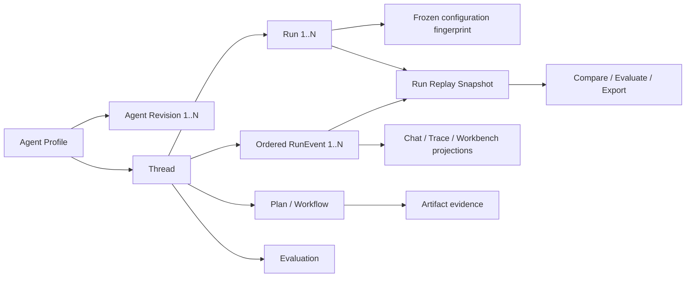
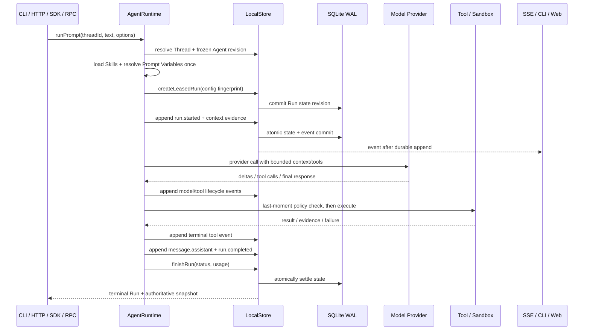
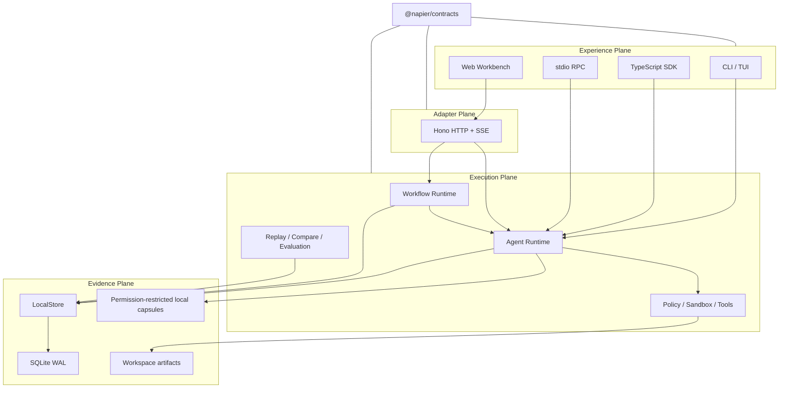

# Napier 项目深度剖析与面试攻防手册

> 适用范围：简历中“Napier：面向复杂任务的全链路可追溯 Agent Runtime”项目。
> 代码基线：本地仓库 `main@34edc58`，核查日期 2026-08-04。
> 使用建议：先背熟第 1、2、9、12 节，再理解第 3～8 节；不要逐字背答案，要能沿着一次 Run 的生命周期把各机制串起来。

---

## 0. 先给结论：这个项目真正值得讲的是什么

Napier 的核心不是“又写了一个能调用工具的 Agent”，而是给 Agent Loop 外围补了一层**持久、可审计、可恢复、可比较的执行基础设施**。

它的核心设计命题是：

> 不把聊天记录当作系统事实源，而是让消息、模型调用、工具调用、计划、审批、产物、恢复和评估进入同一条按 Thread 排序的 Work Ledger；聊天、Trace、Run Lab 和各种状态面板都是对这份执行证据的不同投影。

一句区分度最高的话：

> 普通 Agent 框架重点回答“下一步怎么执行”，Napier 还要回答“当时以什么配置执行、实际发生了什么、产生了什么证据、失败后从哪里恢复、换一个模型会有什么差异”。

项目最能体现工程深度的四点：

1. **领域建模**：Agent Revision、Thread、Run、RunEvent、Plan、Artifact 各自职责清晰。
2. **一致性设计**：SQLite WAL 中可变状态投影与追加式事件在同一事务提交，兼顾快速读取和审计证据。
3. **不确定性治理**：Run Lease、Interrupted 状态、父子 Run、工具副作用分类和 fail-closed 自动恢复。
4. **实验闭环**：Run/Thread Replay、分支、受控重跑、结构化比较、模型评估和 Web Trace 都消费同一份记录。

---

## 1. 面试开场话术

### 1.1 20 秒版本

> Napier 是我设计的 local-first、glass-box Agent Runtime，主要解决长任务里配置漂移、状态分散、失败难恢复和结果缺证据的问题。它用版本化 Agent、Thread、Run 和按序追加的 Work Ledger 组织执行，把模型、工具、计划、审批、产物和恢复记录到一条证据流中，再从同一份记录构建回放、对比评估和可视化。

### 1.2 60 秒版本

> 我观察到很多 Agent 产品把 Chat 当作主状态，但复杂任务不只有消息，还包括模型配置、工具副作用、计划进度、人工审批、工作区产物以及中断后的恢复决策。只存对话无法解释“为什么这么做”，也无法安全地恢复。
>
> 所以我把 Napier 的核心抽象成 Agent Revision、Thread、Run 和 RunEvent。每个 Run 启动时冻结 Agent revision、模型、工具、Skill、Prompt Variable 和预算等配置；执行中所有关键行为写入 Thread 内单调递增的事件流。持久化上不是纯 Event Sourcing，而是把领域状态快照和新事件放进 SQLite 同一事务，并用 revision CAS 处理多个本地 Runtime 的并发写入。崩溃后不会盲目重放工具，而是把不确定 Run 标记为 interrupted，再根据副作用证据决定人工恢复或只读自动恢复。
>
> 在这条记录上，我又做了 Run Replay、Thread Bundle、按序分支、受控实验、指标比较和无工具评估，所以执行、调试和评测没有维护三套互相漂移的数据。

### 1.3 3 分钟版本的展开顺序

只沿一条主线讲，顺序不要乱：

1. 为什么 Chat 不足以做事实源。
2. 四个核心实体：Agent Revision → Thread → Run → Event。
3. 一次 Prompt 如何冻结配置并执行。
4. SQLite 如何原子提交状态与事件。
5. Crash 后为什么创建关联子 Run，而不是续写未知进程。
6. 同一份 Ledger 如何支持 Replay、Compare、Evaluate 和 UI。
7. 主动补充边界：不是纯 Event Sourcing，不保证外部模型输出位级复现，目前是本地单用户产品边界。

---

## 2. 把简历中的每句话落到实现上

简历原文包含四组主张，面试时必须能分别给出“机制、证据和边界”。

| 简历主张                             | 代码中的机制                                                                                                                            | 能证明什么                                                     | 不能夸大成什么                                                                                                           |
| ------------------------------------ | --------------------------------------------------------------------------------------------------------------------------------------- | -------------------------------------------------------------- | ------------------------------------------------------------------------------------------------------------------------ |
| 版本化 Agent 定义                    | `AgentProfile.revision`；每次语义更新生成 `AgentProfileRevision`，带字段差异、来源、System Prompt 哈希和内容哈希；回滚会生成新 revision | 能定位某次 Run 使用的完整 Agent 配置，并保留配置演化历史       | 不是 Git 替代品；也不是所有外部依赖都被内嵌保存                                                                          |
| 任务线程                             | Thread 聚合 Runs、Events、Plans、Evaluations、Subagents 等；Thread 内事件用单调递增 `seq` 排序                                          | 为一个长期目标提供稳定的执行与证据边界                         | Thread 不是一个 OS 线程，也不是分布式工作流队列                                                                          |
| 不可变运行快照                       | Run 含配置指纹；导出的 `RunReplaySnapshot` 绑定 Run、事件、Subagent、指标、事件流哈希和内容哈希                                         | 快照值一旦导出，可独立校验漂移和内容一致性                     | 数据库中的 Run 行不是 WORM；“不可变”指内容寻址的快照产物，不是底层文件永远不可写                                         |
| 追加式事件账本                       | 应用层只有 append；`(thread_id, seq)` 主键、`event_id` 唯一；状态与新事件同事务提交                                                     | 防止正常应用路径覆盖历史；保证 Thread 内有序，提交失败整体回滚 | 没有给每一事件做 predecessor hash chain，也没有 SQLite trigger 禁止管理员直接 UPDATE；不是防恶意本地管理员的不可篡改账本 |
| 对话是交互投影                       | 模型历史和可见会话从 Ledger 中的 message 事件构造；Web/CLI/SSE 也消费相同事件与 ThreadDetail                                            | UI 不是另起一套执行状态；断开流不会取消已经持久化的执行        | 实现不是严格“所有状态只由事件重放”：Thread/Run/Plan 等还有事务化状态投影                                                 |
| 统一承载计划、工具、审批、恢复、验证 | 对应 `plan.*`、`tool.*`、`operator.decision.*`、`run.recovery.*`、artifact/verification 事件                                            | 不同子系统共享身份、顺序、可见性和导出边界                     | 不代表每个工具都保存完整输入输出；隐私敏感内容经常只留哈希和元数据                                                       |
| 回放、评估、可视化闭环               | Run Snapshot、Thread Bundle、Run Compare、Evaluation Service、TracePanel/Run Lab                                                        | 同一 Run 可检查、导出、比较和评估                              | Replay 是历史重建；外部模型重跑仍可能产生不同输出                                                                        |
| 可追踪、可审计、可复现               | 配置指纹、事件序列、内容哈希、workspace/artifact 证据、受控实验                                                                         | 可以追溯输入配置和行为；可做受约束的对照实验                   | 不应承诺任意时刻、任意外部模型、任意有副作用工具的 bit-for-bit 再执行                                                    |

最稳妥的表述是：

> Napier 实现了**可验证的历史回放**和**受控条件下的重执行比较**，而不是声称所有 Agent Run 都能确定性重演。

---

## 3. 核心领域模型

### 3.1 实体关系



### 3.2 Agent Profile 与 Agent Revision

`AgentProfile` 包含：

- System Prompt；
- 默认模型与 thinking level；
- tool policy 和 enabled tools；
- Skills；
- Subagent 角色与预算；
- Run 的 turns/token/cost/time 限额；
- 自动恢复策略；
- Model Advisor；
- Prompt Variables；
- Tool Loop Guard；
- 单调递增 revision。

更新 Agent 时，只有配置语义真正变化才会增加 revision。Revision 记录：

- 完整 profile snapshot；
- changed fields；
- created/updated/rollback/imported/migrated 来源；
- System Prompt SHA-256；
- 完整内容 SHA-256。

回滚不是把历史改回去，而是：读取旧 revision 的内容，基于当前 profile 创建一个**新的 revision**，并记录 `restoredFromRevision`。这保证历史单调增长。

代码入口：

- `packages/contracts/src/execution-runs.ts:46`：`AgentProfile`。
- `packages/contracts/src/index.ts:2577`：`AgentProfileRevision`。
- `packages/runtime/src/agents.ts:232`：revision 构造与哈希绑定。
- `packages/runtime/src/store.ts:1090` 附近：revision 查询、更新和回滚持久化。

### 3.3 Thread

Thread 是长期任务和证据排序的聚合根。它持有：

- `agentId`；
- 当前状态：idle/running/waiting/failed；
- `currentRunId` 与 `runIds`；
- `eventCount`；
- 可选 Goal；
- 可选导入来源；
- 最新消息摘要。

事件的 `seq` 是 **Thread-scoped**，不是 Run-scoped。这样多个关联 Run、恢复 Run、评估 Run 和控制事件能进入同一条时间线。

### 3.4 Run

Run 是一次有明确开始、结束、预算和配置的执行尝试。关键字段：

- status：queued/running/completed/failed/cancelled/interrupted；
- source：user/recovery/schedule/channel/workflow/experiment 等；
- `parentRunId`：恢复、分支或延续的血缘；
- `branchFromSeq`：分支来源位置；
- usage 与 limits；
- `agentRevision`；
- configuration fingerprint；
- 可选 lease。

Thread 是“长期上下文”，Run 是“一次尝试”。失败后创建子 Run 而不是覆写原 Run，才能保留尝试边界。

### 3.5 RunEvent

核心 envelope：

```ts
interface RunEvent {
  id: string;
  threadId: string;
  runId: string;
  seq: number;
  type: string;
  category: EventCategory;
  visibility: "user" | "debug" | "hidden";
  createdAt: string;
  payload: JsonValue;
}
```

三个容易被追问的点：

1. `type` 是开放字符串，事件类型按 additive evolution 演进；旧消费者忽略不认识的类型。
2. `category` 用于跨类型归类，`visibility` 用于投影和隐私边界。
3. Event 只有 envelope 统一，payload 由各领域做严格校验；不是把所有事件塞进一个无约束 JSON 黑洞。

代码入口：`packages/contracts/src/execution-core.ts:56`。

### 3.6 Run Configuration Fingerprint

当前 schema v8 指纹绑定：

- Agent revision；
- model、thinking level；
- tool policy 与规范化后的工具集合；
- Skill 集合及 Skill Catalog 哈希；
- Subagent 与预算；
- Run limits、自动恢复策略、execution mode；
- System Prompt 哈希；
- Prompt Variable catalog/snapshot/resolved prompt 哈希；
- Model Advisor 与 Tool Loop Guard；
- 整体 `contentSha256`。

集合先排序和规范化，避免同一语义因为数组顺序不同产生伪漂移。敏感 Prompt 不复制进配置指纹，只保存哈希。

代码入口：`packages/runtime/src/run-config.ts:140`。

---

## 4. 一次 Prompt 的端到端执行链路

### 4.1 时序图



### 4.2 逐步解释

#### 第一步：入口收敛到同一 Runtime

`createLocalAgentRuntime` 统一创建 Store、Credential Resolver、Model Registry、Extension Manager、Sandbox、Process Manager、File Mutation Manager、Agent Runtime、Workflow Runtime 和实验 Runtime。

CLI、HTTP、SDK、本地 RPC 和 Web 不各写一套 Agent Loop。这个“入口同源”比 UI 功能多更重要，因为否则 Trace 和真实执行很容易漂移。

代码入口：`packages/runtime/src/local-agent-runtime.ts:55`。

#### 第二步：冻结执行配置

`runPrompt` 会：

1. 校验 Prompt 和 Thread 是否已有冲突中的 Run；
2. 选择当前或指定的 Agent revision；
3. 加载该 revision 启用的 Skill；
4. 单次解析 Prompt Variables；
5. 创建带 Lease 的 Run；
6. 把 revision、模型、工具、Skill、变量、预算等固化到 configuration fingerprint。

这里的关键不是“保存一份配置”，而是后续恢复、分支和实验都会验证它是否仍可用或是否发生漂移。

代码入口：`packages/runtime/src/agent-runtime.ts:268`。

#### 第三步：先持久化，再通知观察者

Runtime 的 `record()` 先调用 `store.appendEvent()`，成功以后再触发 `onEvent`。即使 SSE/CLI 消费者断开，callback 错误也被隔离，已经开始的持久执行不会因此丢失。

这是一个很好的面试细节：

> 流式输出是 Ledger 的观察通道，不是持久化本身。持久化成功是因，SSE/CLI 可见是果。

代码入口：`packages/runtime/src/agent-runtime.ts:3331`。

#### 第四步：构造模型上下文与工具集

Live Run 会从 Ledger 构造历史，加入已审核 Memory、Skill、Context Checkpoint、Milestone 和 Delegation Projection；然后按 Agent Profile、Execution Mode 和 Sandbox 能力装配工具。

模型真正调用前还会生成 Model Context Envelope，绑定 System Prompt、provider messages、工具名和工具定义哈希。它强调“实际交给 Provider 的上下文”而不是上层以为传了什么。

#### 第五步：工具在最后一刻做策略判断

工具是否出现在模型 schema 中不等于工具一定能执行。模型发出 tool call 后，Runtime 再根据：

- observe/workspace/unrestricted policy；
- workspace path；
- read/write/unknown effect；
- Extension 审批；
- 受限恢复模式；

执行最后一刻的检查。失败会写 `tool.blocked`，不会直接消失。

代码入口：

- `packages/runtime/src/agent-runtime.ts:1585` 附近：last-moment check。
- `packages/runtime/src/policy.ts:94`：内置工具 policy。

#### 第六步：完成与失败都落证据

正常路径写 `run.completed`，然后 `finishRun` 更新 Run/Thread 状态和 usage。异常路径区分：

- Operator Decision：Run 完成当前尝试，Thread 进入 waiting；
- 预算耗尽：写 `run.budget.exhausted`；
- 用户取消：写 `run.cancelled`；
- 其他失败：写 `run.failed`，并阻塞活跃 Goal；
- 恢复 Run：额外写 `run.recovery.*`。

### 4.3 实际 demo 中能看到的 15 条事件

本次核查用零密钥 `napier/demo` 跑通了完整 CLI JSONL 路径，事件顺序为：

1. `run.started`
2. `context.skills`
3. `context.prompt_variables`
4. `context.tool_loop_guard`
5. `message.user`
6. `context.prepared`
7. 7 条 `model.text.delta`
8. `message.assistant`
9. `run.completed`

终端还输出了：

- 每条事件的 `eventSha256`；
- 一个 `snapshot` frame；
- 一个 `done` frame；
- Snapshot SHA-256 和 Event Stream SHA-256。

这段 demo 最适合用来证明“同一 Runtime、持久事件、流式投影、最终快照”确实是连通的。

---

## 5. 持久化与一致性：最容易体现后端功底的部分

### 5.1 它不是纯 Event Sourcing

Napier 当前实现更接近：

> **事务化状态投影 + 追加式证据日志 + 部分事件派生投影**。

SQLite 中有两类核心数据：

- `workspace_state`：整个领域状态的 JSON snapshot，带 revision；
- `ledger_events`：按 `(thread_id, seq)` 存储的事件。

Operator Decision、Run Control Message、Agent Milestone 等会从 Events 投影；Thread、Run、Agent、Plan 等也保留在 `workspace_state` 中。因此不能在面试里说“所有状态都只靠事件从零重建”。

为什么采用混合方案：

- 只靠事件重放，启动和复杂查询成本高，投影迁移更难；
- 只存当前状态，又失去执行历史和审计能力；
- 将二者同事务提交，可以在当前规模下换取简单、可靠的读取路径。

### 5.2 SQLite 配置

Ledger 初始化使用：

- WAL；
- `synchronous = FULL`；
- foreign keys；
- `trusted_schema = OFF`；
- 5 秒 busy timeout；
- 启动时 `quick_check`；
- schema version 和 migration history。

代码入口：`packages/runtime/src/sqlite-ledger.ts:40`。

### 5.3 原子提交协议

`commit(expectedRevision, stateJson, events)` 的核心步骤：

1. `BEGIN IMMEDIATE`；
2. 读取当前 workspace revision；
3. 与调用方的 `expectedRevision` 做 CAS；
4. 插入本批事件；
5. 将 `workspace_state.revision + 1` 并更新 state JSON；
6. `COMMIT`；
7. 任一步失败执行 rollback。

因此不会出现“事件已提交但状态更新失败”或相反的半提交结果。

代码入口：`packages/runtime/src/sqlite-ledger.ts:165`。

### 5.4 事件顺序如何保证

应用层以 `thread.eventCount + 1` 分配下一个 seq；数据库以 `(thread_id, seq)` 主键兜底，并要求 `event_id UNIQUE`。

本地并发有三层保护：

1. Thread SerialQueue：同 Thread 内 append 串行化；
2. State SerialQueue：内存 state 修改串行化；
3. SQLite `BEGIN IMMEDIATE` + revision CAS：多个 Runtime 实例竞争时检测旧状态并刷新重试。

代码入口：

- `packages/runtime/src/store.ts:11099`：分配事件 seq。
- `packages/runtime/src/store.ts:11614`：序列化并提交 state/events。

### 5.5 JSON/JSONL 文件是什么角色

`workspace.json` 和每 Thread 的 JSONL 是兼容性投影，不是权威存储。SQLite commit 成功后才异步/后置重写这些投影；投影写失败会被计量，但不会推翻已经成功的 SQLite 事务。

这解释了测试“compatibility projections drift 时仍以 SQLite 为准”。

### 5.6 Crash gap 怎么处理

Run 状态创建和 `run.started` 事件不是同一笔超大事务；外部工具副作用与 Ledger 也不可能天然处在一个数据库事务里。因此系统承认 crash gap 的存在，不伪装成全局 exactly-once。

处理方式：

- Run 用 Lease；token 只以哈希形式落盘；
- Worker 周期 heartbeat；
- 启动时将无有效 Lease 的 queued/running Run 变成 interrupted；
- 对未配对的 `tool.started`，副作用结果视为 unknown；
- 自动恢复遇到 unresolved、write 或 unknown effect 会 fail closed；
- 人工 Resume 创建关联子 Run，要求重新检查持久证据。

一句高质量回答：

> 对外部副作用无法靠本地 SQLite 获得 exactly-once，所以我的策略不是“假装事务覆盖一切”，而是显式记录不确定性，通过幂等键、CAS、preview/apply、结果哈希和人工恢复缩小风险面。

### 5.7 当前可扩展性瓶颈

要主动承认：

- 每次 mutation 会序列化完整 `workspace_state`，状态越大写放大越明显；
- compatibility event projection 需要读取/重写 Thread 事件；
- Thread seq 是单点有序，超高吞吐下天然限制并发；
- 当前性能门槛只覆盖 1,000 事件，不代表百万事件能力；
- `store.ts` 和 Server composition root 仍然很大，是明确的架构债务。

规模升级路线：

1. 将 Run/Thread/Plan 等热点状态规范化到独立表；
2. 保留 Event 表作为审计流；
3. 增量物化 projection，按 seq checkpoint；
4. 冷热分层或按 Thread 分区；
5. 多机后把 revision/lease/idempotency 放到支持行级事务的服务端数据库；
6. 再根据需要引入消息队列，不能一上来就用 Kafka 掩盖领域语义。

---

## 6. 权限、工具和结果可信性

### 6.1 三档工具策略

- `observe`：只读观察，不允许 workspace write 或 process execution。
- `workspace`：允许工作区内受控写入与验证。
- `unrestricted`：才允许更高风险的外部浏览器/网络等能力，仍受具体工具检查。

### 6.2 路径逃逸防护

路径检查不是只做字符串前缀：

- 要求 workspace-relative；
- lexical resolve 后必须在 root 内；
- 再做 realpath；
- 拒绝 symlink traversal；
- 打开文件使用 `O_NOFOLLOW`（平台支持时）；
- 保护 `.git`、Napier 数据目录等敏感 segment；
- 执行前后检查文件哈希和大小。

代码入口：`packages/runtime/src/workspace-source.ts`。

### 6.3 写工具为什么要求 expectedSha256

`apply_patch` 的 replace/hashline/hashrange 都要求调用方携带读取时获得的完整文件 SHA-256。执行时如果当前文件不再匹配，就拒绝写入。

它解决的是 TOCTOU/并发覆盖问题：

> 模型基于旧内容做出的修改，不能静默覆盖用户或其他 Run 已经写入的新内容。

多文件变更还采用同目录临时文件、fsync、提交和反向 rollback 验证；如果 rollback 本身不能证明成功，会返回 indeterminate，而不是宣称已恢复。

### 6.4 工具事件保存什么

典型生命周期：

- `tool.started`：callId、toolName、状态及允许公开的 input/effect；
- `tool.completed` / `tool.failed` / `tool.blocked`：结果状态、耗时、策略原因和隐私边界允许的 evidence；
- 对敏感工具，原始 args/output 可能只在受权限保护的 local capsule，portable replay 只带 receipt/hash。

所以“可追溯”不是“把所有敏感内容明文永久保存”，而是：

> 在隐私边界内保留足够的身份、顺序、状态和哈希证据，必要时通过本地 capsule 做受控实验。

### 6.5 结果验证不是让模型自报成功

Napier 的原则是把“做了”与“验证了”分开：

- Workspace 写入有 before/after hash；
- `verify_workspace` 在只读、离线 Sandbox 运行固定类型的检查；
- Plan Artifact 会重新读取实际 workspace bytes 并计算 digest；
- 已验证产物发生 drift 后会失效；
- Model Advisor 能拦截“没有验证证据却声称已验证”的回答。

---

## 7. 中断恢复、审批和长任务控制

### 7.1 手工恢复

重启时，Store 扫描未终止 Run：如果 Lease 已失效，就写成 interrupted，Thread 进入 waiting。

`resume` 不会从模型内部 KV cache 或未知 tool call 中间点继续，而是：

1. 选择 interrupted Run；
2. 读取其配置和事件证据；
3. 创建 `parentRunId` 指向原 Run 的恢复子 Run；
4. 给模型恢复 Prompt，要求先检查持久证据；
5. 未知副作用不自动重放。

这是“语义恢复”而非“进程续跑”。

### 7.2 自动恢复资格

只有同时满足以下条件才允许安全自动恢复：

- 有现代 configuration fingerprint；
- Agent policy 明确开启；
- 原 Run 是 interrupted；
- 不是 Workflow/Experiment 等由上层调度器管理的 Run；
- 不是 demo model；
- 事件数量在边界内；
- 没有 unresolved tool call；
- 没有 write effect；
- 没有 unknown effect；
- 没超过 attempt limit；
- 恢复链可信。

恢复时复用原 Agent revision，并把工具面收缩成只读子集。多个 Worker 通过 claim、TTL、trigger ID 和已有 Run 查询去重。

代码入口：

- `packages/runtime/src/automatic-recovery.ts:95`：资格评估。
- `packages/runtime/src/recovery-service.ts:32`：claim、heartbeat、执行和对账。

### 7.3 Operator Decision

审批不是一条普通聊天消息。它有独立状态机：

```text
pending -> answered -> continued
       \-> cancelled
```

request、answer、continue 是独立 Ledger transition；继续执行必须创建显式关联的 child Run，普通 Prompt 不能绕过待审批状态。

这样做避免了两个问题：

- UI 显示“用户已同意”，但 Runtime 实际没有绑定到那次回答；
- 一条随意消息被误当成高风险操作授权。

### 7.4 Milestone

Agent Milestone 是 predecessor-linked 的不可变进度快照。每个 milestone 自动绑定自上一个 milestone 以来同一 Run 的实际事件范围，下一轮再注入上下文。

它解决长任务中“压缩上下文后计划状态丢失”的问题，但不会取代 Plan/Workflow；它更像 Agent 自己维护的、证据绑定的工作记忆。

---

## 8. Replay、Branch、Experiment、Evaluation：四个概念不要混

### 8.1 四者区别

| 能力                  | 输入                               |          是否执行模型/工具 | 主要用途                           |
| --------------------- | ---------------------------------- | -------------------------: | ---------------------------------- |
| Run Replay            | 一个历史 Run                       |                         否 | 重建并校验当时发生的事件和指标     |
| Thread Replay Bundle  | 整个 Thread                        |                         否 | 可移植导出、验证、导入与 ID 重映射 |
| Branch                | 某 Thread 的 `fromSeq`             | 本身不执行模型；后续可继续 | 从某个消息历史点建立新 Thread      |
| Controlled Experiment | 历史 message/model/tool checkpoint |   是，但隔离、只读或单调用 | 对照模型、上下文或工具行为差异     |
| Evaluation            | 两个 immutable Run Snapshot        | 评估模型只调用一次且无工具 | 按 Rubric 判断质量差异             |

### 8.2 Run Replay Snapshot 如何校验

Snapshot 包含：

- Run Record；
- 该 Run 的 Events；
- Subagent evidence；
- 从事件重算的 metrics；
- Event Stream SHA-256；
- Configuration SHA-256；
- 整体 Content SHA-256。

验证器会重新检查：

- Run/Thread ownership；
- status、时间和事件形状；
- seq 严格递增；
- Model Context Envelope 绑定；
- Subagent 与 Advisor evidence；
- event stream hash；
- configuration hash；
- metrics 重算；
- snapshot content hash。

`generatedAt` 不进入 content hash，因此同样的 Run 内容在不同导出时间仍有稳定身份。

代码入口：

- `packages/runtime/src/run-replay.ts:44`：构造。
- `packages/runtime/src/replay.ts:63`：校验。

### 8.3 Branch 为什么只复制消息

Branch 会：

- 校验 `fromSeq` 必须真实存在；
- 取该 seq 以前的 message events；
- 关联 source Thread、source seq 和当时最后可见 Run；
- 在新 Thread 写 `branch.created`；
- 不复制工具执行与副作用。

原因是历史工具结果可能依赖已变化的外部状态，复制 tool event 会让新分支看起来像已经执行过副作用。需要工具结果复用时，必须走受控实验，且仅支持符合条件的无状态只读工具。

代码入口：`packages/runtime/src/thread-branches.ts:41`。

### 8.4 “可复现”应该怎样回答

把复现分成四级：

1. **历史可复验**：给定 Snapshot，能校验它内部的事件、配置、指标和哈希一致性。
2. **上下文可定位**：知道使用了哪个 Agent revision、模型、Skill、Prompt Variable 和工具集合。
3. **受控可重跑**：隔离分支、冻结上下文、只读 workspace，并可替换模型做比较。
4. **确定性再执行**：相同输入得到完全相同输出。

Napier 强支撑 1、2，针对特定实验支撑 3；对远程生成式模型通常不承诺 4。

### 8.5 Run Compare

Compare 除了比较最终文本哈希，还给出：

- duration、event count、message/model/tool/subagent 数量；
- token 和 cost 差值；
- Event Type delta；
- 新增/移除工具；
- Configuration delta；
- Context coverage delta；
- Trace summary boundary regression。

它先用确定性指标告诉你“哪里变了”，再把质量判断交给 Evaluation。

### 8.6 Evaluation

评估器：

1. 读取两个 Run Snapshot；
2. 固化 Rubric；
3. 创建一个独立 Evaluation Run；
4. 用 temperature 0、zero-tool model 调用；
5. 要求严格 JSON verdict 和逐 criterion 1～5 分；
6. 保存两边 snapshot hash 和 governance evidence；
7. malformed/unavailable evaluator fail closed 为 inconclusive 或失败。

默认 Rubric：correctness、evidence、safety、efficiency。

为降低“模型评模型”的偏差，系统还有：

- append-only human adjudication revision；
- 多 reviewer ballot 和 consensus；
- calibration/confusion matrix；
- Evaluation Suite 与 CI gate；
- Casebook gold set。

代码入口：`packages/runtime/src/evaluation.ts:88`。

### 8.7 可视化为什么不是单纯日志列表

Web Trace 按 event type 投影成专用卡片，展示：

- Run 生命周期与消息；
- Tool、Plan、Workflow、Artifact；
- Milestone、Operator Decision；
- Model Context Envelope 和 Advisor；
- OTLP/JSON export/verify；
- Replay、Run Compare、Evaluation。

重要的是 UI 不拥有第二套运行状态，React 组件依赖 `@napier/contracts`，Runtime 没有 React/HTTP 依赖。

代码入口：`apps/web/src/TracePanel.tsx:64`。

---

## 9. 架构与技术选型

### 9.1 分层



### 9.2 为什么 TypeScript + Node

合理回答：

- Agent Loop、CLI、HTTP、Web、SDK 可共享类型和序列化合同；
- Pi model/tool 生态本身是 TypeScript；
- Node 22+ 自带 SQLite 接口，local-first 部署简单；
- 对 LSP、Node process、浏览器和前端集成友好。

取舍：

- CPU 密集型工作不适合直接堵塞事件循环，所以 SQLite query、kernel、验证等需要 worker/process 隔离；
- Node 的单进程队列不是分布式一致性，需要 SQLite CAS 兜底。

### 9.3 为什么 SQLite 而不是 Postgres/Kafka

当前产品边界是 local-first、单用户，最重要的是：

- 无外部服务即可启动；
- WAL 和事务足够提供本地一致性；
- 一个文件便于备份、导出、迁移；
- 性能满足目前 Thread 规模。

Postgres/Kafka 不是“更高级”的自动答案：前者增加部署成本，后者只能提供事件传输，不能自动解决状态投影和外部副作用一致性。多用户、多机 Worker 成为目标后再迁移更合理。

### 9.4 Workflow 和 Agent Loop 为什么都需要

Agent Loop 适合目标开放、步骤由模型动态决定的任务；Workflow 适合：

- 输入输出 schema 明确；
- 节点依赖明确；
- 需要 retry、breakpoint、approval；
- 需要稳定重跑和 checkpoint 实验；
- 产物必须按 manifest 交付。

Workflow 不是另一套 Runtime：Agent node 仍创建真实 Run，所有节点状态和 evidence 仍写同一 Ledger。

Workflow 支持 agent、deterministic、tool、map、loop、reduce、approval、JavaScript、Python 等节点，调度器按 Plan ready step 和 `maxConcurrency` 选择 batch；节点 input/output 必须经过 manifest schema。

代码入口：`packages/runtime/src/workflow-runtime.ts:51`。

### 9.5 架构治理

`npm run check:architecture` 会检查：

- production/test 文件行数预算；
- cyclomatic complexity；
- public export ceiling；
- 相对 import 的 SCC；
- Workspace package 单向依赖。

本次核查结果：831 个 source modules、433 个 test modules、0 个允许循环，Architecture Audit 通过。

但要诚实说明：这是 ratchet，表示“不能继续恶化并逐步拆债”，不表示所有文件已经足够小。当前 `packages/runtime/src/store.ts`、`apps/server/src/app.ts` 和 Contracts 大入口仍是显著技术债务。

---

## 10. 关键不变量：资深面试官最爱问

能说出这些不变量，比背功能列表更有说服力。

### 10.1 Ledger 不变量

1. 同 Thread 的 seq 严格单调递增。
2. `(threadId, seq)` 唯一，eventId 全局唯一。
3. Event 的 Thread 必须和正在修改的 Thread projection 一致。
4. State revision 与事件批次在一个 SQLite 事务中提交。
5. 已提交事件不通过应用 API 更新或删除。

### 10.2 Run 不变量

1. 普通情况下同 Thread 只允许一个 active Run；同一 Workflow 的受控并行节点例外。
2. Run 的 Agent 必须等于 Thread Agent。
3. Run 启动时冻结 Agent revision、configuration 和 limits。
4. 有 Lease 的 Run 只有持有正确 token 的 Worker 能 heartbeat/finalize。
5. terminal Run 不再恢复原进程状态；恢复创建 linked child。

### 10.3 Tool 不变量

1. tool call 执行前必须再次过 policy。
2. Workspace 写路径不能逃逸或穿越 symlink。
3. 修改旧文件必须匹配 expected hash。
4. `tool.started` 必须有 terminal evidence；缺失则 outcome unknown。
5. 不确定副作用不能自动恢复。

### 10.4 Replay/Evaluation 不变量

1. Snapshot 的 event 必须属于目标 Thread/Run。
2. 事件顺序、event stream hash、metrics 和 content hash必须可重算。
3. Evaluation 必须绑定左右 Snapshot hash 和固定 Rubric。
4. Evaluator 不获得工具，异常或不完整 JSON fail closed。
5. Branch 不伪造历史工具执行。

---

## 11. 设计取舍与已知缺陷

### 11.1 优点

- 一个证据主线支撑执行、调试、恢复、评估和 UI。
- 本地部署简单，凭证值不进入 portable state。
- Crash 和未知副作用被显式建模。
- Config/Artifact/Context 使用 hash 做漂移检测。
- 不依赖模型自报成功，验证器读取真实 workspace 状态。

### 11.2 代价

- Ledger schema 和事件 payload 验证代码量很大。
- 隐私脱敏和可调试性之间需要持续取舍。
- 完整状态 JSON 带来写放大。
- 多种能力让 Store、Contracts、Server composition root 变重。
- 哈希很多，普通用户容易被治理细节淹没，UI 必须做渐进披露。

### 11.3 安全边界

不要说“不可篡改”，应说“tamper-evident within the application trust boundary”。原因：

- SQLite 文件所有者仍能直接修改数据库；
- 普通 content hash 被有写权限的攻击者重算后不能提供身份认证；
- Ed25519 receipt 只覆盖签名的特定 artifact/governance envelope，不等于每个 Ledger event 都签名；
- local-first 假设本机账户和数据目录是主要信任边界。

如果要升级：事件批次做 predecessor-linked Merkle/hash chain，周期 checkpoint 由外部密钥签名或写入独立透明日志。

### 11.4 复现边界

影响再执行一致性的因素：

- Provider 模型版本变化；
- 非确定性采样与服务端实现；
- 时间、网络、网页、数据库等外部状态；
- 工具实现升级；
- Workspace bytes 漂移；
- 隐私策略不允许 portable replay 携带原始 context。

Napier 的策略是记录和冻结能控制的部分，对不可控制部分显式标注，而不是承诺魔法般确定性。

### 11.5 工程规模与历史风险

当前仓库有两个面试风险，必须提前准备真实答案：

1. 简历写项目从 2026.05 开始，但当前 Git 可见历史从 2026-07-26 的大型 baseline commit 开始。只有在事实确实如此时，才能解释为“早期原型在别处，后来 squash/import baseline”；否则应修正简历时间。
2. Git author 是 `Napier Agent`，提交密度很高。若使用 AI 辅助开发，应坦诚：AI 负责了哪些代码生成/重构，你本人负责了哪些需求定义、架构取舍、不变量、验收、测试和风险判断。

不要把“独立设计实现”解释成“每个字符都手敲”。更可信的定义是：

> 我对问题定义、架构、接口、不变量、质量门槛和最终交付负责；第三方库和 AI 辅助是实现手段。对于没有亲自判断或无法解释的代码，我不会声称是自己的设计成果。

面试前务必能列出至少 3 个**你本人做出的取舍**，例如：

- 选择混合 state snapshot + append ledger，而不是纯 Event Sourcing；
- Branch 只复制 message，不复制 tool side effect；
- 自动恢复遇到 unknown effect fail closed；
- exported replay 用 hash，敏感原文放 local-only capsule；
- Agent rollback 创建新 revision，不覆盖旧 revision。

---

## 12. 高频深挖问题与回答骨架

### Q1：为什么 Chat 不能作为事实源？

Chat 只能表达用户和模型说了什么，无法完整表达：实际模型配置、工具调用状态、权限拒绝、产物哈希、预算消耗、审批前后关系、Crash 时未完成副作用。复杂任务如果只存 Chat，恢复时会把“模型说做了”误当成“系统证明做了”。Napier 将 Chat 降为 Ledger 的 message projection。

### Q2：你是不是做了 Event Sourcing？

不是严格的纯 Event Sourcing。当前是 SQLite 中事务化状态 snapshot 与 append-only evidence events 同步提交；部分状态从事件投影，其他聚合保留当前状态。这样换取简单快速的本地查询，同时保留审计流。规模增大后会把热点 projection 规范化并增量构建。

### Q3：append-only 如何保证？

正常应用 API 只提供 append；Thread seq 由内存 projection 分配，数据库 `(thread_id, seq)` 主键和 `event_id` unique 兜底；state 与 event 同事务提交。它是应用信任边界内 append-only，不是 WORM，拥有 SQLite 文件写权限的人仍可篡改。

### Q4：多个进程同时写会不会丢事件？

单实例内有 Thread/State 串行队列，多实例之间由 SQLite `BEGIN IMMEDIATE` 和 workspace revision CAS 检测冲突；发现旧 revision 后刷新权威 state 并有界重试。相关测试覆盖两个 Store 实例并发写且不丢事件。

### Q5：为什么不用数据库自增 ID 做 seq？

需要的是每 Thread 连续的逻辑顺序，并且 seq 要和 Thread projection 的 eventCount 在同事务一致。当前用 projection 分配、复合主键兜底，适合本地吞吐；分布式版本可用按 Thread 的行锁/sequence allocator。

### Q6：状态已经有 SQLite snapshot，为什么还要 Event？

Snapshot 回答“现在是什么”，Event 回答“如何变成这样”。恢复、审计、对比和评估需要后者；启动和日常查询又需要前者。关键是二者必须同事务，否则会出现状态和证据分叉。

### Q7：Run Snapshot 为什么叫不可变？

它是一个 self-contained value object，内容由 event stream hash、configuration hash、重算 metrics 和整体 content hash绑定。生成后任何字段变化都能被 verifier 检出。不是说数据库 Run record 物理不可写；Run 在执行期间当然会从 running 变为 terminal。

### Q8：Replay 和重新执行有什么区别？

Replay 是读取并校验历史，保证“当时记录是什么”；重新执行会重新调用模型/工具，结果受外部状态和非确定性影响。Napier 通过 controlled experiment 冻结 Agent revision、Prompt Variables、Skills、Memory、Workspace snapshot，并限制只读工具，把重跑变量收窄，但不承诺任意 Run 位级复现。

### Q9：为什么 Branch 不复制 tool events？

复制会造成“新分支已经执行过旧副作用”的假象，而且旧 tool result 可能已失效。普通 Branch 只复制消息和 lineage；符合条件的 stateless read-only tool result 才能在实验模式中按 exact call order 复用。

### Q10：模型调用到一半进程崩了怎么办？

Lease 失效后 Run 被标记 interrupted。不会假设 Provider 是否已完成，也不会续接不可见的模型内部状态。人工 Resume 创建 child Run，读取 Ledger 证据后继续；自动恢复只在无未知/写副作用且配置可信时进行。

### Q11：工具已经执行成功，但 `tool.completed` 还没写就崩了呢？

这是外部副作用经典 crash gap。系统会看到 unmatched `tool.started`，将 outcome 视为 unknown，阻止自动恢复。内置文件工具通过 expected hash、preview/apply 和 workspace 后验状态降低不确定性；外部服务要依赖 idempotency key/查询接口或人工确认，不能靠本地事务伪造 exactly-once。

### Q12：你实现 exactly-once 了吗？

没有对所有外部工具承诺 exactly-once。内部 state/event commit 是 exactly-once transaction；schedule/recovery 等用 trigger ID 和 claim 做去重；外部副作用采用 at-least-once/unknown outcome 的显式模型和幂等设计。

### Q13：为什么要 Run Lease？内存 active map 不够吗？

内存 map 只能防单进程重复，进程崩溃后无法证明所有权。Lease 给 Run 一个可过期的持久 owner，token 原文只在 worker 手里，数据库保存 token hash；heartbeat 失效后其他启动实例才能把 Run 判为 interrupted。

### Q14：恢复为什么不修改原 Run？

修改会抹掉“第一次尝试失败在什么位置”。父子 Run 保留 attempt boundary、原配置、原 usage 和原事件，比较和审计也更清晰。

### Q15：Agent 配置变了，恢复用新版本还是旧版本？

安全恢复用原 Run 的 Agent revision，避免把配置变化混入恢复结果。如果旧 revision 或 Skill catalog 已不可用/漂移，自动恢复 fail closed，由操作者明确决定。

### Q16：回滚 Agent 为何生成新 revision？

覆盖当前历史会破坏审计。“回滚”在配置账本中也是一次新决策，所以新建 revision，并记录 restoredFromRevision。

### Q17：Prompt 中有当前日期，怎么复现？

Prompt Variables 在 Run 启动前单次解析，保存 catalog hash、snapshot hash、resolvedAt 和 rendered System Prompt hash。后续同一 Run 不重新解析；受控实验可复用源 Run 的解析时间。

### Q18：为什么大量只存哈希，不存原文？

模型上下文、工具参数和输出可能含代码、路径、隐私或凭证。Portable Replay 要能证明“比较的是同一个对象”，但不应扩大数据泄露面。哈希提供身份和漂移检测；确需精确实验的内容放权限受限、容量有界的 local-only capsule。

### Q19：哈希能防攻击者篡改吗？

普通哈希只能做完整性检测，能写数据的人也可能重算哈希。身份认证需要签名或外部锚点。Napier 对特定 receipt 支持 Ed25519，但不能把它泛化成全 Ledger 防篡改。

### Q20：如何防止 Agent 写出 workspace？

三层：policy 先限制工具能力；path 做 lexical resolve + realpath containment；文件操作拒绝 symlink 并用 `O_NOFOLLOW`。写入还要求 expected hash，保护目录被显式拒绝。

### Q21：为什么工具暴露给模型后还要 last-moment policy check？

工具 schema 可能在上下文构建后发生配置、Extension trust 或 execution mode 变化；而且“模型看得到”不是授权。真正副作用发生前重新检查，才能把授权绑定到实际 call。

### Q22：如何防并发覆盖用户文件？

读工具返回完整文件 hash；写工具要求 expectedSha256。当前 bytes 不匹配就拒绝，不做 last-write-wins。多文件提交失败时尝试逆序 rollback，并再次验证工作区状态；无法证明 rollback 则标 indeterminate。

### Q23：模型说测试通过了，你就信吗？

不信。测试/格式检查由 `verify_workspace` 在只读离线 Sandbox 执行；Artifact 由 Runtime 读取实际 bytes 计算 hash；Model Advisor 还能基于 Ledger 判断是否存在验证证据。

### Q24：Evaluator 也是模型，怎么保证评估可信？

不保证绝对客观，所以分层：确定性 compare 先算 metrics/config/tool delta；模型 evaluator 无工具、固定 rubric、temperature 0、严格 JSON，且绑定 immutable snapshot；再用 human adjudication、reviewer consensus、calibration 和 suite gate 校准。异常一律 fail closed。

### Q25：为什么 Evaluation 也创建 Run？

评估本身也消耗模型、上下文和成本，也可能失败。把它作为 Run，评估过程同样可追溯，而不是在系统外偷偷调用一次模型。

### Q26：Workflow 和 Plan 的关系？

Plan 提供步骤、依赖、状态和 Artifact manifest；Workflow manifest 提供可执行节点类型、typed bindings、schema、retry、parallelism、approval 和 breakpoint。Workflow scheduler 驱动 Plan step transition，Agent node 仍通过普通 Agent Runtime 创建真实 Run。

### Q27：并行 Workflow 如何保证依赖正确？

只从当前 Plan 的 ready steps 选 batch，最多 `maxConcurrency`；每个节点拿隔离的 execution context copy，完成后将 node result/output 合并回主 context，再重新读取权威 Plan。Map 和 Approval 有更严格的调度规则。

### Q28：审批如何防止被普通聊天绕过？

Thread 有 open Operator Decision 时，新 Run 必须携带 exact decision ID、origin Run parent 和原 Agent/model binding。answer 与 continue 是不同事件；普通 Prompt 缺少 capability，Store 直接拒绝。

### Q29：SSE 断开会不会让 Run 丢失？

不会。事件先持久化再 callback；observer callback 失败被隔离。客户端重连后用 Thread seq 增量拉取，最终以 Ledger 和 authoritative snapshot 为准。

### Q30：当前最大性能瓶颈是什么？

不是模型调用，而是状态规模增长后的完整 JSON serialization、projection rewrite 和大型领域 Store。当前 1,000-event 基线表现良好，但不能外推到百万事件。下一步是状态表规范化与增量 projection。

### Q31：性能数据怎么测的？

保存的 local CI baseline 在 macOS arm64、Node 24、deterministic demo 上跑 3 个冷 CLI 样本、25 次 `read_file` 和 1,000-event Thread。中位首事件约 629 ms、首 token 777 ms、完成 1.079 s；read p95 0.333 ms；append p95 3.103 ms；1,000-event detail projection 7.044 ms；数据库约 754 bytes/event。

必须立即补充：该首 token 不含外部 Provider 网络延迟，RSS 是观察值不是硬配额，数据只代表本机回归基线。

### Q32：为什么 local-first？

Agent 要直接操作用户 workspace、代码、终端和本地凭证；local-first 减少数据出域和部署依赖，也便于单文件 Ledger。代价是目前多用户权限、远程 Worker 和集中运维能力有限。

### Q33：和普通 Trace/日志系统有什么不同？

普通日志通常是旁路、弱 schema、可能丢失，也不驱动状态。Napier Ledger 参与 Run/Thread/审批/恢复的领域不变量，Replay 和 Evaluation 直接消费它。它既是 operational evidence，也是一部分业务状态转换依据。

### Q34：和通用 Workflow 引擎相比有什么不同？

通用 Workflow 引擎擅长确定性 task orchestration；Napier 关注模型上下文、工具证据、workspace 产物、Agent revision 和实验比较。未来可以把 durable scheduler 委托给成熟引擎，但 Work Ledger 的 Agent 语义仍然需要保留。

### Q35：为什么不直接使用 Pi/其他 Agent 框架？

Napier 实际复用 Pi 的模型与 Agent Loop 能力，不重复造 provider adapter。自研部分集中在 durable domain model、Ledger、policy/sandbox、recovery、replay/evaluation 和多入口产品化。要明确区分“集成的基础能力”和“自己设计的差异化层”。

### Q36：最难的技术问题是什么？

推荐回答 crash consistency：模型/工具/文件/数据库跨越多个事务域，无法获得一个全局 ACID 事务。核心不是写更多重试，而是把 unknown outcome 一等建模，并让恢复资格依赖可验证的副作用证据。

### Q37：如果重做一次，你最先改什么？

先缩小核心：将 Thread、Run、Agent Revision、Event 和 Artifact 拆成规范化 Store port，避免 `workspace_state` 整体序列化；同时保留同事务事件提交。第二是给核心事件批次引入签名 checkpoint。第三是从真实任务成功率反推能力优先级，减少治理面过宽。

### Q38：项目最大的失败或不足是什么？

早期过度扩展能力面，导致 Store、Contracts 和 Server composition root 过大。后来加入 Architecture Ratchet、单向依赖和零循环检查，并持续抽模块，但债务仍未完全清掉。这个回答比“没有失败”可信。

### Q39：你怎么证明项目不是 PPT？

现场做三件事：跑零密钥 CLI 看有序 JSONL；导出/验证 Run Replay；展示并发事务、replay 防篡改和 automatic recovery 的聚焦测试。不要拿 LOC 当成果。

### Q40：你个人做了什么？

只回答真实内容，按“决策—实现—验证”说：我定义了哪些不变量和合同；为什么选择 SQLite hybrid；怎样处理 unknown side effect；怎样设计 replay/evaluation；如何用 fault tests、benchmark 和 architecture gate 验收。第三方模型库、LSP、Playwright、SQLite 等明确说是集成，不说成自研。

---

## 13. 白板题：现场画什么

### 13.1 画一次 Run

只画六个盒子：

```text
Entry -> AgentRuntime -> Policy/Tools -> LocalStore -> SQLite
                 \                         |
                  ------ Model Provider    +-> SSE/Web projection
```

然后沿时间轴写：

```text
freeze config -> create leased Run -> append events -> execute
-> terminal evidence -> finish state -> snapshot/compare
```

### 13.2 画 Crash 恢复

```text
Run A running
  |
  +-- tool.started --X process crash
                         |
                    lease expires
                         |
                    Run A interrupted
                         |
             effect known read-only?
                /                 \
              yes                 no/unknown/write
              |                        |
      auto recovery claim          operator review
              |
      child Run B(parent=A)
```

### 13.3 画持久化事务

```text
BEGIN IMMEDIATE
  check workspace revision == expected
  insert ledger_events batch
  update workspace_state + revision
COMMIT

after commit:
  refresh workspace.json / thread.jsonl compatibility projections
```

---

## 14. 现场演示脚本

### 14.1 最小 demo

```bash
node apps/cli/dist/index.js run \
  --workspace . \
  --data-root /tmp/napier-demo-data \
  --model napier/demo \
  --prompt "Inspect the execution contract and summarize one invariant." \
  --jsonl
```

讲解点：

- 不需要 API Key；
- stdout 只有 JSONL；
- 每个 event 有 Thread/Run/seq/type/visibility；
- 最后有 snapshot 和 done；
- configuration fingerprint 中没有明文 System Prompt，但有哈希。

### 14.2 聚焦测试

```bash
npx vitest run \
  packages/runtime/test/transactional-store.test.ts \
  packages/runtime/test/run-config.test.ts \
  packages/runtime/test/thread-branches.test.ts \
  packages/runtime/test/replay-evaluation.test.ts \
  packages/runtime/test/agent-runtime.test.ts \
  packages/runtime/test/automatic-recovery.test.ts \
  packages/runtime/test/agent-milestones.test.ts \
  packages/runtime/test/operator-decisions.test.ts \
  --maxWorkers=2 --testTimeout=30000
```

本次核查结果：8 files / 100 tests 全部通过。

### 14.3 架构检查

```bash
npm run check:architecture
```

本次核查结果：通过，0 allowed cycles。

### 14.4 演示时不要做的事

- 不要现场跑完整 2,000+ tests，时间不可控；
- 不要依赖外部模型 Key 和网络；
- 不要展示巨大的 README 功能清单；
- 不要用代码行数证明质量；
- 不要现场尝试有副作用的真实外部工具。

---

## 15. 代码导航地图

| 主题                   | 文件与入口                                                        | 阅读目标                                             |
| ---------------------- | ----------------------------------------------------------------- | ---------------------------------------------------- |
| Serializable Contracts | `packages/contracts/src/execution-core.ts:56`                     | RunEvent envelope、category、visibility              |
| Agent/Run Contract     | `packages/contracts/src/execution-runs.ts:46`、`:156`             | Agent Profile、Run Record、configuration fingerprint |
| Thread/Replay Contract | `packages/contracts/src/index.ts:2618`、`:3739`、`:6241`、`:6849` | Thread、Run Snapshot、Thread Bundle、Thread Detail   |
| Local composition      | `packages/runtime/src/local-agent-runtime.ts:55`                  | 所有入口如何共享 Runtime service                     |
| Agent execution        | `packages/runtime/src/agent-runtime.ts:268`、`:1201`              | Run 创建、模型循环、工具装配、完成/失败              |
| Durable event callback | `packages/runtime/src/agent-runtime.ts:3331`                      | 为什么先持久化再 stream                              |
| Agent revision         | `packages/runtime/src/agents.ts:232`                              | revision hash 与 rollback provenance                 |
| Run fingerprint        | `packages/runtime/src/run-config.ts:140`                          | 配置冻结和 canonicalization                          |
| Domain store           | `packages/runtime/src/store.ts:11099`、`:11182`、`:11614`         | seq、Run 不变量、state/event commit                  |
| SQLite ledger          | `packages/runtime/src/sqlite-ledger.ts:40`、`:165`                | WAL、schema、CAS transaction                         |
| Tool policy            | `packages/runtime/src/policy.ts:94`                               | observe/workspace/unrestricted 与路径判断            |
| Branch                 | `packages/runtime/src/thread-branches.ts:41`                      | exact seq lineage 与 message-only copy               |
| Run snapshot           | `packages/runtime/src/run-replay.ts:44`                           | metrics/event/config hashes                          |
| Replay verifier        | `packages/runtime/src/replay.ts:63`                               | 独立重算和 fail-closed                               |
| Automatic recovery     | `packages/runtime/src/automatic-recovery.ts:95`                   | safe eligibility                                     |
| Recovery worker        | `packages/runtime/src/recovery-service.ts:32`                     | claim、heartbeat、dedupe、settle                     |
| Workflow               | `packages/runtime/src/workflow-runtime.ts:51`                     | ready batch、schema、retry、artifact settlement      |
| Evaluation             | `packages/runtime/src/evaluation.ts:88`                           | snapshot-bound zero-tool judge                       |
| Web Trace              | `apps/web/src/TracePanel.tsx:64`                                  | Ledger 到可视化投影                                  |

建议阅读顺序：Contracts → `runPrompt` → Store/SQLite → Replay → Recovery → Evaluation → Workflow → Web。

---

## 16. 可引用的工程证据与数字

### 16.1 已实际核查

- 8 个核心测试文件，100 个测试通过；
- 零密钥 built CLI 完成一次 15-event Run，输出 Snapshot 和 Done hash；
- Architecture Audit 通过，0 allowed cycles；
- SQLite 并发、事务 rollback、legacy migration、projection drift 有专门测试；
- Replay 测试覆盖 event stream、metrics、config、Advisor/Artifact tamper；
- Recovery 测试覆盖多 Store claim、原 revision、只读工具面和 Skill drift。

### 16.2 保存的 performance baseline

环境：macOS arm64、Node 24.16、本地 deterministic demo，2026-07-31 artifact。

| 指标                          |        保存值 |
| ----------------------------- | ------------: |
| CLI first event median        |    629.453 ms |
| CLI first token median        |    777.299 ms |
| CLI completion median         |  1,078.766 ms |
| Runtime bootstrap             |     21.606 ms |
| `read_file` p95               |      0.333 ms |
| 1,000-event append p95        |      3.103 ms |
| 1,000-event Thread projection |      7.044 ms |
| SQLite bytes/event            | 753.664 bytes |

限制条件必须随数字一起说：

- 外部 Provider 网络延迟未计入；
- 只有 3 个 CLI 冷启动样本；
- 1,000-event 是回归门槛，不是容量上限证明；
- RSS 是观察峰值，不是 hard quota；
- 当前代码变化后应重新跑 benchmark 才能称为最新数据。

---

## 17. STAR 项目叙述模板

### Situation

> 通用 Agent 在短对话中可用，但一旦任务跨多轮、调用有副作用工具、发生配置变化或进程中断，只靠 Chat 很难回答执行事实和恢复边界。

### Task

> 我希望做一个本地优先的 Runtime，让一次复杂任务从配置、行为到产物都能追溯，并能基于同一证据做恢复、回放和评估。

### Action

> 我先定义 Agent Revision、Thread、Run 和 RunEvent 四个核心实体；用 SQLite WAL 将状态 projection 与 append events 同事务提交；Run 启动时冻结配置和预算，用 Lease 处理进程所有权。工具层加入 workspace containment、last-moment policy、expected hash 和验证证据。Crash 后将未知执行标成 interrupted，自动恢复只允许可信的只读链。最后在 Ledger 上构建 Snapshot、Branch、Compare、Evaluation 和 Web Trace。

### Result

> 当前形成了 CLI/HTTP/SDK/RPC/Web 共用的一条 Runtime 路径；核心的事务、恢复、回放和审批测试本次抽查 100/100 通过；本地 deterministic 基线下 1,000-event Thread projection 约 7 ms。更重要的是，系统能明确区分历史回放、受控重跑和不可保证的模型确定性。

不要虚构用户数、线上收入或成功率。如果没有真实用户指标，就用“工程不变量、fault test、benchmark、可运行 demo”作为结果。

---

## 18. 简历表述校准建议

当前一条 bullet 信息密度过高，面试官很容易任选一个词追到底。可以拆成两条，让核心更聚焦：

> - **Agent Runtime 与证据账本：**独立设计并实现 local-first Napier Agent Runtime，以版本化 Agent、Thread/Run 和 SQLite 追加式 Work Ledger 为主线；将模型、工具、计划、审批、产物与恢复事件纳入统一证据流，并以配置指纹、Run Lease、workspace CAS 和副作用分级保证可追踪与安全恢复。
> - **回放与评测闭环：**基于同一 Ledger 构建 Run/Thread Replay、按序分支、受控只读实验、结构化 Run Compare 与无工具 Rubric Evaluation，并在 CLI/HTTP/SDK/RPC/Web Trace 中共享同一 Runtime 与协议。

如果仍保留“可复现”，建议改成：

> “支持可验证历史回放与受控条件下的重执行比较”

比无条件的“可复现”更准确，也更经得住追问。

---

## 19. 面试前自测清单

做到以下每项，才算真正掌握：

- [ ] 不看材料，20 秒讲清项目定位。
- [ ] 画出 Agent Revision、Thread、Run、Event 的关系。
- [ ] 从 `runPrompt` 讲到 `finishRun`，不遗漏配置冻结、Lease、事件和工具 policy。
- [ ] 解释为什么不是纯 Event Sourcing。
- [ ] 解释 SQLite state + event 同事务和 revision CAS。
- [ ] 解释 unmatched `tool.started` 为什么阻止自动恢复。
- [ ] 区分 Replay、Branch、Resume、Experiment、Evaluation。
- [ ] 明确“可复现”的四级边界。
- [ ] 说出哈希与签名的区别。
- [ ] 说出至少三个已知瓶颈和升级路线。
- [ ] 能现场跑零密钥 CLI demo。
- [ ] 能指出 10 个核心源码入口。
- [ ] 准备真实的项目时间线解释。
- [ ] 准备真实的 AI 辅助开发边界和个人决策清单。
- [ ] 不用 LOC、功能数量或模糊“全链路”替代技术证据。

---

## 20. 最后要记住的五句话

1. **Napier 的差异化不是 Agent Loop，而是围绕 Agent Loop 的 durable evidence fabric。**
2. **它是状态快照与追加事件同事务的混合架构，不是纯 Event Sourcing。**
3. **Replay 证明历史，Experiment 收窄变量，外部模型仍不保证确定性再执行。**
4. **Crash 后最重要的不是盲目重试，而是识别未知副作用并 fail closed。**
5. **“独立设计实现”要落到本人做出的架构取舍、不变量和验收责任，而不是代码行数。**
