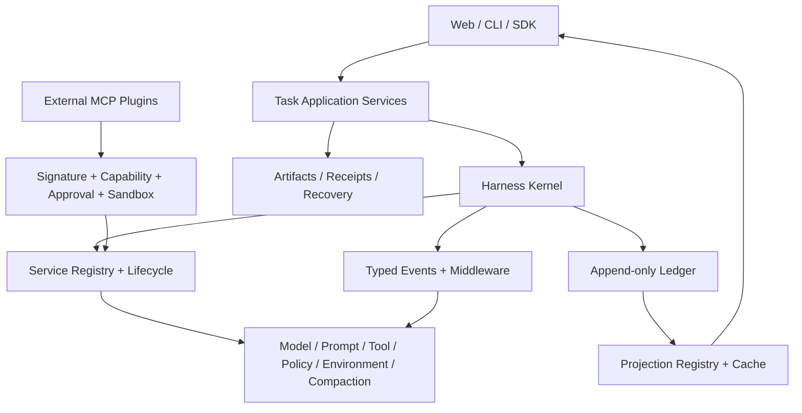
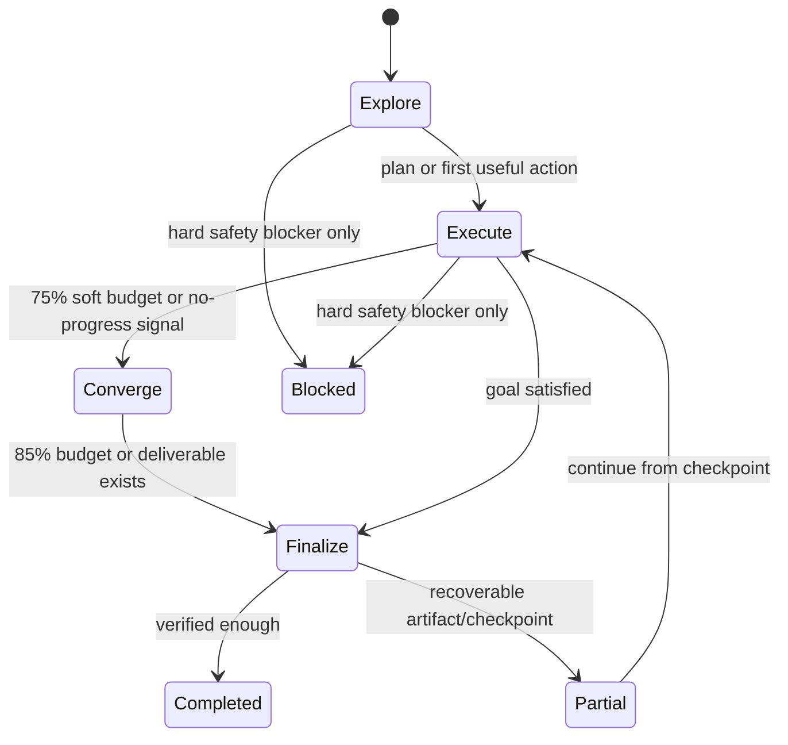
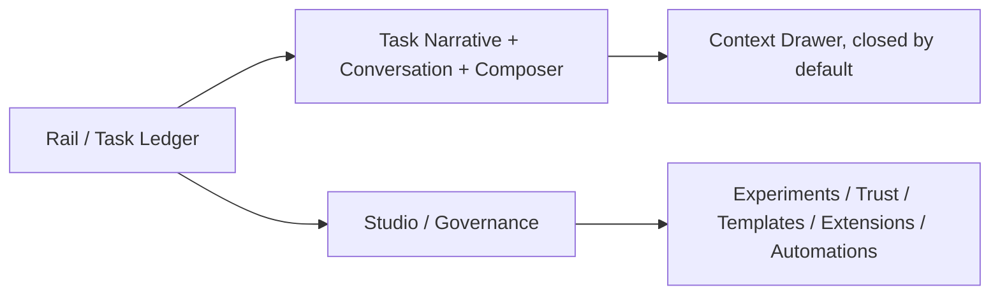

# Napier Next：可组合 Agent 工作台

> 基线：2026-08-16，`main` 与 `origin/main` 均位于 `1cfa384`。
>
> 本文是新的唯一推进目标，替代此前所有阶段、门禁、完成度和测试约定。
>
> DeepSeek Harness（下称 DSH）与 oh-my-pi（下称 OMP）是设计参考，不是兼容目标，也不是要被逐行复刻的实现。

## 1. 北极星

Napier 要成为一个真正适合持续工作的本地 Agent 工作台：

**像 DSH 一样可组合、安静和易扩展，同时保留 Napier 更强的工作台叙事、证据账本、恢复能力与安全边界。**

默认体验必须足够简单：用户输入任务，Agent 立即开始产生有用结果；计划、工具、文件、浏览器、审批和恢复信息按需出现。高级治理、实验和发布能力不能继续挤占默认任务界面。

推进是否成功，优先看以下结果，而不是测试数量、文档数量或凭证数量：

1. 用户能否更快发起并完成真实任务。
2. 新能力能否以低耦合方式接入、替换和卸载。
3. 长任务能否持续运行、恢复并解释关键行为。
4. 桌面和移动端默认路径是否清晰、可靠。

## 2. 当前完成情况

Napier 已经不是早期原型，但尚未形成连贯、轻量、可持续扩展的产品。

| 维度 | 当前判断 | 事实与主要缺口 |
| --- | --- | --- |
| Agent 执行面 | 基本可用 | 默认 Agent 已具备模型、Shell、文件、浏览器、MCP、计划、审批与恢复能力，真实任务可以运行。 |
| 任务收敛与收口 | P0 缺口 | Agent 能执行大量步骤，但缺少基于真实进展的阶段预算、临界收口和部分成功回收；长任务可能在产物已经存在时仍以整体失败结束。 |
| Browser | 可用 | Napier 原生 Browser 与 Browser Use 本地路径均已有真实成功样本，不应继续作为主线阻塞项反复验证。 |
| Controlled Track | 已通过当前门槛 | `controlled-harness-evidence-0.1.0/0.1.1/0.1.2` 均报告 `controlledTrackReady: true`。旧文档中的未完成判断已经失效。 |
| Default Product Track | 未闭环 | 仓库账本中尚无完整的默认产品试用事件；能力存在，但“普通用户从页面完成任务”的证据不足。 |
| 前端桌面体验 | 有辨识度但过载 | 深绿侧栏、象牙纸张、衬线标题、红色批注形成了独特的研究账本气质；但默认三栏承载了过多治理、实验、模板、信任和调试信息。 |
| 前端移动体验 | P0 问题 | 390px 视口下主区域、标题、卡片和输入框横向溢出并被裁切，不能视为可用。 |
| 运行时架构 | 能工作但集中 | `AgentRuntime` 仍直接依赖大量具体实现，服务替换、生命周期和跨模块扩展缺少统一边界。 |
| 数据与事件 | 语义丰富但写放大明显 | 账本已有约 27.8 万事件，绝大多数是模型增量；近期批处理降低了新事件密度，但每次事件仍可能触发整状态序列化和 JSONL 重写。 |
| Web 数据消费 | 可用但成本持续增长 | `ConversationLedger` 等组件仍在浏览器端从完整事件数组重复计算活动、计划、文件、引用、浏览器和工具状态；线程历史状态与最新用户尝试也没有被清晰区分。 |
| 扩展系统 | 安全能力强，组合能力窄 | 现有签名、能力声明、审批和 MCP 包治理值得保留；但它主要解决外部工具分发，还不是模型、提示词、策略、会话、投影和 UI 的统一扩展机制。 |
| 发布准备 | 部分完成 | 公共签名发布和 Windows 主机验收仍是外部发布事项，应进入独立发布泳道，不得阻塞产品主线。 |

### 2.1 两个失败会话的证据审计

本节记录的是可复现的系统症状，不把某一次模型输出当成孤立事故。

| 会话 | 账本证据 | 实际失败 |
| --- | --- | --- |
| `thread_a90ab5cc84854a6b89b6`：为 AI 新闻网页补图片 | 最新运行 `run_3d42477401e84d77826f` 前 3 个 turn 只完成了 409 行 HTML 的分段读取；第 4 个模型 turn 从 16:49:39 持续到 17:26:21，期间写入 9,649 条 thinking delta 和 103 条 text delta。30 分钟 run timeout 已触发，但流没有及时停止；最终 `create_plan` 才被预算拦截，工作区没有发生本轮修改。 | 小型可逆编辑被升级成“读取全文件 → 设计 14 张 SVG → 创建详细计划”，没有 action-first；旧的逐 delta 持久化放大了流处理时间；run timeout 不能可靠终止 in-flight stream；预算结束前没有收口机会。 |
| `thread_8c0f576b6b054962ac79`：制作挂谷猜想网页 | 单次运行 20 分 49 秒内使用全部 64 个模型 turn：9 次搜索、9 次 fetch（4 次失败）、25 次 JavaScript Kernel（3 次失败/阻塞）、11 次 command、9 次 patch、3 次 Browser（2 次被策略拦截）。第 38 个 turn、开始约 14 分 24 秒后才出现第一次文件 mutation。最终 `kakeya/index.html` 已存在且为 70,702 字节，但计划只记录 research 完成、scaffold 运行中，artifact 未登记。 | 研究和验证吞掉过多前置预算；现有 loop guard 只识别“相同参数 + 相同结果”的连续调用，无法识别不同脚本/命令组成的无效循环；没有为交付保留 turn；预算耗尽后没有扫描并回收已经落盘的产物。 |

补充判断：

- 两个链接使用了同一个 conversation artifact hash，但第二个线程的 Inspector 实际展示了自己的 `plan_afe7...`，没有证据证明计划数据真的跨线程污染。UI 仍应清除不属于当前 thread/run 的无效 hash，避免形成串线错觉。
- 挂谷任务已经成功创建本地服务租约 `http://127.0.0.1:63845/`，其 network mode 为 `outbound_denied_loopback_service`；随后 Browser 仍以“outside the public HTTP(S) boundary”拒绝同一地址。这是两个安全组件之间缺少能力交接，不是用户权限选择错误。
- `1cfa384` 已加入模型 delta 批处理，因此旧会话的逐 token 事件洪水已被部分缓解；但事件 append 仍可能触发整状态和 JSONL 重写，且批处理不能解决模型取消、无进展和收口问题。
- 当前 `AgentRuntime` 对普通 run failure（包括预算耗尽）调用 `blockGoalForRunFailure`。预算耗尽本应是可继续的运行状态，却被提升成整个 Goal 的 blocker，直接放大了 UI 的失败感。

### 2.2 根因链


因此不能只把 `maxTurns` 从 64 调大。单纯提高上限会让低效循环持续更久。正确方向是：**更早行动、按进展调度预算、临界时强制收敛、耗尽时确定性回收、恢复时从 checkpoint 继续。**

综合判断：**底层能力覆盖已经较高，产品闭环和架构可组合性处于中段。当前第一优先级是建立“能够主动收敛和回收部分成功”的执行控制面，然后再把已有能力组织成清晰、轻量、可扩展的默认产品。**

## 3. 从 DSH、Cordis 和 OMP 借鉴什么

### 3.1 应吸收的设计

1. **Everything is a Plugin 的边界意识**

   模型、工具、提示词、策略、会话存储、上下文压缩和 UI 贡献都通过稳定服务边界协作。这里的重点是可替换性，不是把每个文件都拆成 npm 包。

2. **空间可组合性**

   组件声明自己需要和提供的服务，不直接导入另一个组件的具体实现；依赖出现时激活，依赖消失时安全停用。

3. **时间可组合性**

   每一次注册、副作用和监听都返回 disposer，并在卸载时按相反顺序撤销。插件卸载后，不留下事件监听、路由、工具、定时器和 UI 插槽残留。

4. **类型化事件与中间件**

   将事实事件、实时流事件和能力接缝事件分开。模型请求、工具调用、权限策略等关键路径允许中间件包裹、短路或增强，而不是不断扩大中央 orchestrator。

5. **追加日志与投影**

   对话和执行事实追加写入；任务摘要、活动列表、计划、文件和统计由纯投影生成。客户端消费带水位的完成投影，不再各自重放完整原始事件。

6. **Profile / Bundle 配置组合**

   用 base、web、cli 和 user overlay 组合运行配置；能够查看最终解析后的配置，避免配置来源隐藏在大量构造函数和环境分支中。

7. **UI 插槽与渐进式披露**

   主界面只保留任务所需的最少信息；扩展通过有限、稳定、可撤销的插槽贡献页面、详情或操作，不任意侵入整个 DOM。

### 3.2 明确不照搬的部分

- DSH 当前仍是 developer preview，公共契约可能破坏性变化；Napier 不直接依赖其内部 API。
- 不进行“大爆炸式插件化”，也不为了形式拆出大量小包。
- 不允许第三方代码默认在主进程内任意执行。第一方插件可进程内组合，外部插件继续通过 MCP、进程隔离、签名和能力审批运行。
- GitHub `dsh-plugin` topic 只用于发现，不能作为可信度证明。
- 不照搬 DSH 长会话中逐行堆叠 trajectory 的信息密度；Napier 的阶段叙事和结果优先视图应继续成为特色。
- 不以热更新、插件市场或完整协议兼容作为第一阶段目标。

### 3.3 从 OMP 借鉴执行效率，而不是复制产品形态

OMP 对本次两个失败会话最有价值的不是 TUI，而是把模型常见的低效行为固化成 harness 能力：

1. **摘要式读取 + 稳定编辑锚点**

   对超过阈值的代码和结构化文档，首次读取默认返回声明、结构和真实省略区间；模型按需补读局部范围。每次可编辑读取返回由“路径 + 内容版本”生成的稳定锚点，patch 必须校验锚点，过期则拒绝或重新定位。Napier 已有 `expectedSha256`，应在此基础上补齐范围/结构锚点，而不是立即引入另一套完整 patch DSL。

2. **流式 thinking-loop guard**

   在 thinking delta 仍在流动时识别连续字面重复、近似段落簇、低新颖度且没有新文件/符号锚点的推理，以及“不断换标题但从不行动”的过度规划。命中后立即中断当前 stream，丢弃无可见价值的失败推理，只允许一次短重试，并注入“执行最小动作或进入收口”的隐藏重定向。

3. **首包、空闲与语义进展 watchdog**

   区分首包超时、stream 空闲、只有 keepalive 而没有语义进展、以及本地工具仍在工作的合理静默。调用方 abort 必须能与底层 iterator 竞争，即使 provider 没有正确传播 signal，也不能让 `next()` 一直挂住。

4. **副作用感知的 turn recovery**

   只有确认未执行副作用的失败调用才能透明重试；已经完成的工具结果必须保留并作为 continuation 上下文，避免重复写文件、启动服务或发送外部请求。Provider/stream 瞬时失败最多自动重试一次，随后降级或收口，不照搬长时间多轮 retry。

5. **大输出转 artifact、上下文只留摘要**

   工具输出被截断时保存完整内容并返回可定位引用；模型上下文只保留摘要、关键尾部和 artifact URI。这样既保留证据，也避免把大量日志反复送回模型。

6. **按模型能力调参**

   thinking 上限、tool-use turn 输出、loop guard 和 compaction reserve 由 model family/profile 决定；不再用一套宽松上限覆盖所有模型。

明确不复制：OMP 的完整 TUI、宿主机宽工具面、默认多次长重试、内核模式和复杂编辑语法都不是当前前置。Napier 继续保留持久账本、Web 工作台、审批、sandbox 与可恢复任务语义。

## 4. 目标架构



### 4.1 Harness Kernel

Kernel 只负责以下稳定机制：

- 服务注册和按键解析；
- 显式依赖、启动、停止和 dispose；
- turn / step 生命周期；
- 类型化事件和中间件调度；
- profile 的装配与最终配置检查。

Kernel 不包含 Browser、模型供应商、搜索、文件编辑、计划或业务 UI 的具体逻辑。

第一版不替换 `AgentRuntime` 的公共入口。`AgentRuntime` 继续作为兼容 facade，内部逐步把具体依赖接到 Kernel；只在被触达的垂直链路迁移，禁止一次性重写全部运行时。

### 4.2 服务与插件契约

所有新服务遵守以下规则：

- 使用稳定且有命名空间的 service key，例如 `napier.model.v1`；
- manifest 声明 `id`、`version`、`provides`、`requires`、`capabilities`、host/client entry；
- 插件只能访问声明过的依赖；
- 每次注册必须返回幂等 disposer；
- 生命周期至少包含 `setup → start → stop → dispose`，失败时能够逆序清理；
- 可选依赖不得让核心路径停机；依赖环优先通过提取更小接口或 integration plugin 消除；
- 公共服务变更使用兼容版本范围，不依赖“名字相同就一定兼容”。

第一批只开放六个接缝：

1. `sessions`
2. `events`
3. `models`
4. `prompts`
5. `tools`
6. `policy`

只有一个新接缝被至少两个真实实现使用时，才继续抽象下一层。

### 4.3 事件、存储与投影

事件分为三类：

- **Durable facts**：影响恢复、审计、用户可见结果或后续上下文的事实。
- **Live stream**：模型 delta、进度、临时日志等实时信号，默认合并，不要求逐条持久化。
- **Capability hooks**：请求模型、调用工具、审批和策略决策的可包裹接缝。

目标数据流：

1. SQLite 追加 durable event，提交后同步发布水位。
2. 高频 delta 在内存窗口合并，形成可恢复的消息 checkpoint，而不是形成海量永久事件。
3. `workspace.json` 只保存低频工作区配置和必要快照。
4. JSONL 是导出或检查点产物，不在每个事件后全量重写。
5. 投影使用纯 `init / apply / view` 约定，记录 `stateVersion` 和 event watermark。
6. Web 优先订阅服务端投影；冷启动读取缓存加尾部事件，不下载整个历史再多次折叠。

首批投影：

- thread summary；
- task narrative；
- conversation feed；
- active plan；
- files and artifacts；
- current approvals and recovery state。

### 4.4 信任边界

Napier 已有的签名、权限、审批、sandbox、receipt 和 capsule 不是负担，而是产品差异化能力，但它们必须从默认界面退到正确层级。

- 第一方/仓库内插件可在进程内运行，并遵守显式依赖和可逆生命周期。
- 第三方插件默认走 MCP 或独立进程，继续执行签名、来源、能力和审批检查。
- “插件能够被加载”不等于“插件获得全部权限”。
- 权限系统只在 fail-open、秘密泄露、未确认破坏性操作或数据损坏风险时阻塞主线。
- 缺少非关键权限时降级相应能力并继续任务，界面提供一次明确修复入口。

### 4.5 Completion Control Plane

先在 `AgentRuntime` facade 后增加一个独立小型执行控制面，负责“预算、进展、收敛、收口、恢复”，不继续把分支散落进 `AgentRuntime`；M1 再通过 typed hooks 将它接入 Kernel。这样无需等待插件化即可先修复真实失败。



#### Budget Orchestrator

- Run deadline、每 turn deadline、推理字节/时长上限和工具 deadline 使用同一个可取消 deadline tree。
- model adapter 必须履行 cancellation contract：收到 abort 后停止消费 provider stream、丢弃排队 delta、关闭 generator；宽限期后仍未退出则隔离该 stream，并记录 adapter cancellation failure。
- 不再让单个工具调用或单次模型推理占满整个 run。普通 tool-use turn 使用较小输出上限，最终交付 turn 才获得较大输出预算。
- 60% 预算执行一次进展检查；75% 停止新增研究和扩大计划；85% 只允许完成当前修改、最小验证、登记产物和用户交付。
- 至少保留 6 个 model turn、3 分钟 wall time 和 10% token budget 中最早触发的一项作为 finalization reserve。
- 只有最近窗口存在可度量进展且仍低于 cost/security hard cap 时，允许一次有限自动延期；无进展时禁止靠增加预算续命。
- 预算观测包含 in-flight turn，不能像当前 timeout snapshot 一样少计正在运行的第 4 个 turn。
- model stream 必须有首包、空闲和语义进展 watchdog；run abort 与 iterator `next()` 做竞争，默认 5 秒宽限后从当前 run 隔离迟到事件。
- 每个 run 维护 side-effect journal；重试前判定 tool call 为 `not_started / started_unknown / completed`，只有 `not_started` 可以无条件透明重放。

#### Progress Governor

每个 turn 后更新一个轻量 Progress Vector：

- workspace mutation digest；
- plan revision 与步骤状态；
- 新增/更新 artifact candidate；
- 新的有效 source、approval 或 capability 状态；
- 是否产生面向用户的阶段结果。

执行规则：

- build/edit 任务应在 3 个 turn 或 3 分钟内产生第一次可逆 mutation；否则自动进入 action-first reroute。
- research 仅在事实准确性确实需要时进行，默认不超过总工作预算的 25%；创作型任务先建立可看的骨架，再补内容。
- 连续 6 个 turn 或 3 分钟没有 Progress Vector 变化时触发 `run.no_progress`；只允许一次带摘要的 reroute，仍无进展则进入 Finalize/Partial。
- 同一 capability 的结构性失败在本 run 内缓存。例如 Browser 已确认不接受某类 URL 后，不再让模型重复尝试 start/navigate。
- 现有 exact-call loop guard 继续保留，用于阻止完全相同的调用；Progress Governor 负责识别不同参数但没有产品进展的工具漫游。
- 单文件、小范围、可逆修改不强制创建 durable plan；复杂任务的计划创建限一个 turn，执行优先于继续细化计划。
- 首次读取大文件默认生成带真实省略区间的结构摘要；补读只取需要的范围。所有修改使用内容版本和范围锚点，避免“全文件分段读取后才开始行动”。
- thinking stream 同时受 OMP 式 loop guard 约束：字面重复、近似段落簇、低新颖度无新锚点、过多推理标题但无工具调用任一命中时，立即转入一次 action-first 重试；第二次命中直接 Finalize。

#### Deterministic Finalizer

Finalizer 不依赖模型仍有完整预算才能工作：

1. 停止创建新研究、进程和扩展工具调用。
2. settle/close 当前进程、Browser session 和可逆 effect。
3. 对比 run-start workspace digest，找出真实新增或修改文件。
4. 将符合计划 artifact path 的文件登记为 `candidate`；存在且可读取但未验证时绝不能丢失。
5. 把运行中的 plan step 标为 `interrupted/partial` 并写入 checkpoint，而不是把整个计划和 Goal 设为 blocked。
6. 生成确定性 interruption summary：已完成、已有文件、未验证内容、失败能力、继续入口。
7. 若还有 reserve，允许一次短 finalizer model call 改善用户说明；没有 reserve 时直接使用确定性摘要。
8. 将被截断的大型 tool/model 输出保存为 run artifact，checkpoint 只记录摘要、定位信息和内容 hash。

运行结果至少区分：

- `completed`
- `partial`
- `paused_budget`
- `blocked_capability`
- `blocked_safety`
- `cancelled`
- `failed_unrecoverable`

普通 timeout、turn exhaustion 或外部 capability 缺失不再自动 block Goal。只有 `blocked_safety` 或没有任何安全恢复路径的 `failed_unrecoverable` 才能提升为 Goal blocker。

#### Run-scoped Task / Plan / Artifact

- 每条用户请求形成独立 task attempt，绑定 `threadId + runId + intentId`。
- 最新 attempt 的状态与历史已完成计划分开投影；旧产物继续可见，但必须标注“上一轮结果”。
- artifact 状态支持 `candidate → produced → verified`；预算耗尽时至少保留 candidate。
- Continue 从 checkpoint、新增/修改文件和剩余计划开始，不重复已完成研究和全文件读取。
- conversation anchor 必须同时校验 thread、run、plan、artifact 与 event seq；无效或外线程 hash 自动清除并回到当前 attempt。

#### 安全的本地预览租约

不能直接把 Browser 改成允许任意 localhost。正确方案是复用现有 egress-denied local service：

- `workspace_process` 创建 local service 时签发 run-bound lease，绑定 process id、精确 origin、identity hash、过期时间和只读用途。
- Browser policy 只接受携带有效 lease 的精确 origin；禁止换端口、重定向到其他 loopback/private address、凭证 URL 和 service 关闭后的访问。
- Browser runtime/proxy 为该 lease 建立一次性路由，而不是全局 bypass loopback。
- service settle、run abort 或 lease 到期时同步撤销 Browser 访问。
- 对纯静态 artifact 可提供 sandboxed artifact preview；Agent 需要截图验证时仍走上述租约。

## 5. 前端方向：Calm Ledger

前端目标：**采用 DSH 的浅色、安静、留白和渐进披露作为工作区基调，保留 Napier 的信息架构（Task Narrative、活动分组、产物优先、关键恢复）。**

> 2026-08-17 决策：应用户要求，工作区整体切换为 DSH 风格的浅色系（近白侧栏、白色纸面、蓝色强调、无衬线字体），覆盖此前「深森林绿 / 象牙纸 / 衬线 / 暗红批注」的编辑部视觉身份。侧栏、页头、欢迎页、composer 和 drawer 以浅色 token 统一驱动。同时把台账相关中文改为「会话」，并修掉泄漏的英文与翻译腔文案。

### 5.1 视觉基调（DSH 浅色）

- 近白侧栏、白色主纸面、冷中性分隔线与克制阴影；
- 蓝色（`--ledger` ≈ `#4d6bfe`）作为唯一强调色，用于选中、悬停、主按钮和品牌标记；
- 无衬线字体统一标题与正文；不再使用衬线、斜体和旋转的编辑部装饰；
- 保留 Task Narrative 的 `Working / Completed / Next`；
- 保留活动分组、产物优先、关键恢复和证据入口；
- 去掉纸张网格线、folio 装饰红线和蜡封印章等强编辑部痕迹，改为干净的 DSH 卡片与列表。

### 5.2 新的信息架构



桌面默认布局：

- 左侧 56–64px rail；需要时展开任务账本，不永久占据大面积。
- 中间是唯一视觉主角：任务叙事、对话、当前活动和输入框。
- 右侧详情默认关闭；只有用户选择文件、计划、浏览器、错误或收据时才打开。
- `Workflow experiment desk`、blueprint、模板、信任目录、扩展发布、casebook 和自动化管理迁入独立 `Studio` 页面或 Advanced 区域。

默认输入框只展示：

- 任务输入；
- 当前模型；
- 简化的权限预设；
- 发送按钮。

模式、环境、附件、实验参数放入 `+` 菜单或命令面板。任务运行后再显式出现 steer 和 stop。不得同时常驻多组 readiness、scope、mode 和 settings 控件。

对话默认视图：

- 用户请求和最终结果优先；
- 工具调用按任务阶段聚合为少量 activity group；
- 当前阻塞错误自动展开，已恢复错误折叠为一行；
- thinking、trace、receipt 和原始事件只在详情中展示；
- 产物、修改文件和下一步靠近对应结果，不沉入长事件流底部。

### 5.3 响应式硬要求

- 390px 宽度下无横向滚动、无裁切、无超出视口的 composer。
- 移动端保留 56px rail 或收起为顶部入口；主区域宽度必须由剩余视口计算。
- 详情、任务列表和 Studio 使用 overlay / sheet，不与主内容并排。
- 触控目标不小于 40px；标题、状态和按钮能够折行或缩略。
- 桌面参考宽度为 1440px，但内容列保持适合阅读的上限，不用空卡片填满屏幕。

### 5.4 前端工程约束

- `styles.css` 不再继续无限增长。新工作按 shell、ledger、conversation、composer、drawer、studio 和 tokens 拆分所有权。
- 颜色、字体、间距、边框、圆角、阴影和 motion 进入 tokens；不在组件内散落新魔数。
- Inspector 面板通过固定 slot 注册；默认 shell 不直接 import 所有高级面板。
- 组件从服务端 projection/view-model 获取整理后的状态，避免各自扫描 `detail.events`。
- 可访问性保持基本键盘操作、焦点和对比度，不在当前阶段追求完整设计系统认证。

## 6. 推进路线

以下阶段按用户可感知价值排序。每一阶段交付可运行的垂直切片，不先铺设完整基础设施。

### M0-A — Completion Control Plane（立即开始）

目标：先让 Agent 能及时停止无效推理、尽早产生修改，并在预算边界可靠交付已有成果。

按以下垂直切片顺序推进；每一片完成即可合入和使用，不等待整个控制面一次成型：

- [ ] **A1 硬取消与收口**：统一 run/turn/tool deadline tree；abort 后 5 秒内停止 stream 消费并隔离迟到 delta；加入 finalization reserve、确定性 Finalizer 和新的结果分类；普通预算耗尽不再调用 `blockGoalForRunFailure`。
- [ ] **A2 进展治理**：记录 Progress Vector；build/edit 任务 3 turn 或 3 分钟无首次 mutation 时 action-first reroute；研究默认不超过 25%；6 turn 无进展只重定向一次，随后收口。
- [ ] **A3 OMP 式高效读写与防循环**：增加结构摘要读取、内容/范围锚点；增加流式 thinking-loop/过度规划 guard、语义 idle watchdog 和最多一次的副作用感知重试。
- [ ] **A4 安全本地预览**：让 Browser 只接受当前 run 的精确 local-service lease；service settle/abort 后撤销，其他 localhost 继续拒绝。
- [ ] **A5 尝试态与部分产物**：以 `threadId + runId + intentId` 投影当前 attempt；预算耗尽时扫描 workspace delta，登记 artifact candidate、checkpoint 和继续入口；无效跨线程 anchor 自动清理。

完成标准：

- 用 `thread_a90ab5cc84854a6b89b6` 的事件序列做确定性回放，loop guard/timeout 能快速终止长推理，返回 `paused_budget` 或 `partial`，且不会自动 block Goal；禁止为了验收真实等待 30 分钟。
- 用 `thread_8c0f576b6b054962ac79` 做确定性回放，能够发现 `kakeya/index.html` 已落盘并登记 candidate/checkpoint；继续任务不重复 research。
- 一个真实的单文件编辑 smoke 在 3 turn 或 3 分钟内产生可逆 mutation；一个真实本地静态页面能通过精确 lease 预览，而任意其他 loopback 仍被拒绝。
- 每个切片只写覆盖核心状态转换的少量确定性测试，再运行一次相关 smoke；不扩展到全模型、全权限、全平台矩阵。

### M0-B — Calm Shell

目标：用现有运行时先交付一个明显更清爽、真正可用的默认页面。

- [ ] 修复 390px 横向溢出、裁切和 composer 尺寸问题。
- [ ] 将右侧 Inspector 改为默认关闭的 contextual drawer。
- [ ] 新会话页面只保留品牌、简短引导和主输入框。
- [ ] 简化 composer；高级模式和环境选项收进菜单。
- [ ] 工具步骤按阶段聚合；默认突出 task narrative、结果、文件和下一步。
- [ ] 把实验、模板、信任、扩展发布、casebook 和自动化管理迁入 Studio / Advanced。
- [ ] 保留 Napier 颜色、排版和账本细节，建立第一批 UI tokens。

完成标准：

- 1440px 和 390px 各手工走通一次新建任务、观察运行、打开详情、查看结果。
- 移动端没有横向溢出；桌面默认不出现治理面板墙。
- 一张桌面截图和一张移动截图足以说明变化；不要求像素级快照系统。

### M1 — 可组合 Kernel 垂直切片

目标：证明 DSH 式组合边界适合 Napier，而不重写整个 AgentRuntime。

- [ ] 实现最小 `ServiceRegistry`、typed service key、依赖解析和 disposer stack。
- [ ] 实现 base / web / cli profile 及 resolved-config inspect。
- [ ] 将现有 model、prompt、tool、policy 以 adapter 接入，保持原公开 API。
- [ ] 为 `turn.start/end`、`model.request`、`tool.request/result` 建立 typed hooks。
- [ ] 将 M0-A 的 Completion Control Plane 通过 typed hooks 接入，避免重新实现另一套预算和恢复逻辑。
- [ ] 让一个真实 research/coding 任务完整经过新 Kernel 路径。
- [ ] 证明 provider 可以替换，插件 stop/dispose 后无残留注册。

完成标准：一个真实任务使用新装配路径成功完成；旧入口继续工作；不要求此时迁移 Browser、MCP、compaction 和全部 provider。

### M2 — Ledger 与 Projection 重构

目标：去掉事件写入的整状态放大，并降低长会话的前端计算成本。

- [ ] 将 durable event append 与 workspace snapshot 持久化解耦。
- [ ] 模型实时增量继续批处理，只在必要边界创建可恢复 checkpoint。
- [ ] abort 或 stream 隔离后丢弃迟到 delta；durable watermark 不接受已终止 run 的排队事件。
- [ ] JSONL 改为显式导出、turn-end 或低频 checkpoint 更新。
- [ ] 建立 projection registry、version、watermark、cache + tail replay。
- [ ] 首先迁移 thread summary、task narrative、conversation、plan、files 六个投影。
- [ ] Web 改为消费 projection，逐步删除组件内全事件重复折叠。
- [ ] 为历史大线程提供兼容读取或一次性懒迁移，不阻塞新格式上线。

完成标准：普通事件追加不再重写整个 `workspace.json` 和线程 JSONL；长线程打开和追加事件的成本不随全部历史线性重复增长；现有任务能够恢复。

### M3 — 插件成为产品能力

目标：把安全扩展与内部可组合机制统一成一条清晰路径。

- [ ] 定义 manifest、版本、依赖、能力和 host/client entry。
- [ ] 提供 tool、provider、prompt、projection 和有限 UI slot 注册。
- [ ] 将三个代表性内置能力迁为第一方插件，优先 Browser、Search、Artifact。
- [ ] 保留并复用现有 MCP 签名、来源、审批和 sandbox，不再创建第二套外部信任系统。
- [ ] 提供一个最小示例插件和脚手架，能够 install / enable / disable / inspect。
- [ ] 禁用或卸载插件时清理所有注册，不影响无关任务。

完成标准：内部插件能被替换和卸载；外部插件仍在隔离边界运行；用户能从一个入口理解“它提供什么、需要什么权限、当前是否启用”。

### M4 — 默认产品闭环与 Beta

目标：证明 Napier 的默认页面，而不是测试 harness，能够持续完成用户任务。

- [ ] 用默认 Web 路径完成一次 research、coding、Browser、审批恢复、文件产物和长任务续跑。
- [ ] 将两个失败会话作为固定恢复样本：验证 action-first、部分产物回收、预算续跑和 local preview lease。
- [ ] 至少形成一轮 6 个核心用例的 Default Product Trial 记录。
- [ ] 记录真实失败、绕行和用户摩擦，按影响排序进入下一轮，不要求本阶段全部修完。
- [ ] 清理明显失效的版本、控制证据和 UI 文案漂移。
- [ ] 公共签名发布与 Windows host 验收放入 Release Lane，具备环境时再执行。

完成标准：用户仅从默认页面即可完成核心工作流；失败后能恢复或明确降级；形成下一轮按真实使用排序的优化清单。

## 7. 快速推进协议

这一节优先级高于旧文档、旧测试习惯和旧阶段门禁。后续 Codex 必须遵守。

### 7.1 主线优先

- 每次工作都要交付一个用户可见能力或一个真实架构切片，不能只交付测试、文档、receipt、schema、fixture 或 verifier。
- 先完成 happy path，再记录边角问题；不在同一轮追求所有平台、所有模型、所有权限组合和所有失败分支。
- 一个阶段的功能已能真实使用时立即进入下一阶段，细节优化放入 backlog。
- 不因旧 artifact、旧版本号、非关键快照或历史样本漂移停止实现。
- 不主动扩展本阶段范围；相邻问题只有在阻断当前垂直切片时才顺手修复。

### 7.2 阻塞时间盒

- 同一问题最多进行 **2 次实质不同的尝试或 20 分钟**，先到者为准。
- 超过时间盒后，记录：阻塞条件、已尝试方法、当前影响、可接受降级、后续入口。
- 若存在 mock、feature flag、兼容 adapter、跳过非关键 provider 或手工验证路径，采用可逆降级并继续主线。
- 权限缺失只禁用相关能力，不能让整个工作台或无关任务停住。
- 外部网络、签名服务、Windows 环境、第三方账号和偶发 CI 故障默认进入独立 blocker/release 清单。

### 7.3 什么才是硬阻塞

仅以下情况允许停止当前主线：

- 可能造成用户数据丢失或不可逆损坏；
- 可能泄露密钥、隐私或敏感内容；
- 未经确认会执行破坏性外部操作；
- sandbox、审批或权限出现 fail-open；
- 当前改动导致被触达的主入口无法构建、启动或完成 happy path；
- 数据迁移无法兼容读取且可能破坏现有工作区。

除此之外的问题都应降级、隔离、记录并继续推进。

### 7.4 测试预算

测试的目标是防止主线倒退，不是证明系统在所有极端条件下完美。

- 普通功能切片：优先一次真实手工 smoke；如已有精准测试，只运行最相关的一组。
- 单个工作切片最多安排一次常规验证，目标在 10 分钟内结束；同一代码未变化时不重复运行。
- 只改前端布局时，不运行全仓后端测试；只改 adapter 时，不运行无关 Browser、权限或发布矩阵。
- 阶段收口运行受影响应用的 build/typecheck 加一个核心 happy path；失败只修复与本阶段直接相关的问题。
- 只有涉及数据损坏、秘密、sandbox/approval fail-open、不可逆操作时，才要求针对性负向测试。
- flaky、极端权限组合、低概率时序、完整跨平台、全量回归和性能压测进入 hardening/release 阶段。
- 不为了测试方便引入新的大型测试框架；不把补齐所有旧测试当作新功能前置条件。

### 7.5 每轮交付格式

每轮结束只需要报告：

1. 本轮真正可用的新能力；
2. 修改的关键文件；
3. 实际运行的一次验证及结果；
4. 已知但不阻塞的缺口；
5. 下一块最有价值的垂直切片。

不要用大量通过的测试、生成的凭证或重复的完成声明掩盖产品没有前进。

## 8. 架构护栏

- 不进行全仓重写；所有迁移保持可运行，并通过 facade/adapter 渐进替换。
- 不建立与现有 MCP 扩展并行的另一套外部插件信任系统。
- 不允许未信任第三方插件直接获得主进程和完整工作区能力。
- 不把每个模块拆成独立包；只有稳定边界和独立生命周期值得成为插件。
- 不让原始高频事件成为所有 UI 的公共数据 API。
- 不让任何高级面板无条件进入默认 shell。
- 不继续向 `AgentRuntime`、`LocalStore`、`ConversationLedger`、`ContextPanel` 和全局 `styles.css` 堆叠跨域职责；被触达时优先抽出新边界。
- 不因抽象“未来可能需要”而实现尚无第二个真实消费者的接口。
- 不删除 Napier 的账本、恢复、receipt、capsule、审批和 artifact 语义；应将其变得更清晰、更按需，而不是弱化。
- 不用提高 `maxTurns`、timeout 或 token cap 代替进展治理和确定性收口。
- 不因普通预算耗尽、可降级 capability 缺失或可恢复 partial result 自动阻塞整个 Goal。
- 不为解决本地预览而全局放开 localhost/private network；只接受精确、短期、run-bound service lease。
- 不进行无上限自动重试；透明重试前必须确认副作用状态，默认最多一次。

## 9. 当前优先级看板

| 优先级 | 项目 | 状态 | 下一动作 |
| --- | --- | --- | --- |
| P0 | Completion Control Plane | Ready / immediate | 先做 M0-A1：硬取消、Finalizer、结果分类，并移除普通预算失败对 Goal 的自动阻塞。 |
| P0 | Progress / OMP Guard | Ready after A1 | 做 M0-A2/A3：action-first、结构摘要与锚点、thinking-loop guard、一次副作用感知重试。 |
| P0 | Local preview / attempt recovery | Ready after A1 | 做 M0-A4/A5：精确 lease、artifact candidate、checkpoint 与当前 attempt 投影。 |
| P0 | Calm Shell 与移动端修复 | Ready after M0-A core | 从真实页面和现有布局基线开始实现 M0-B。 |
| P0 | Default Product Track | Blocked by product flow | M0-A/M0-B 后直接用默认页面跑真实任务，不先新增 test harness。 |
| P1 | Harness Kernel 垂直切片 | Ready | 以 model/prompt/tool/policy adapter 为第一条链路。 |
| P1 | Event append / projection | Ready after M1 seam | 先消除每事件整状态/JSONL 重写，再迁 Web 投影。 |
| P1 | Plugin manifest 与 UI slots | Pending | 在 Kernel 和 projection 证明后开展。 |
| P2 | Studio / Advanced 治理页 | Included in M0-B/M3 | 先迁出现有面板，再逐步插件化。 |
| Release Lane | 公共签名、Windows、全矩阵 | External | 不阻塞 M0-A–M4；发布环境具备时执行。 |
| Hardening | 压测、极端权限、完整 a11y、像素回归 | Deferred | 由真实使用和 Beta 风险排序触发。 |

## 10. 给继续推进 Goal 的 Codex Prompt

```text
继续推进 Napier 的 /Users/bytedance/projects/Napier/goal.md。

先读取 goal.md、AGENTS.md 和当前工作区状态，然后直接从“当前优先级看板”中最高优先级、未完成的垂直切片开始实现。当前必须从 M0-A1 Completion Control Plane 开始；不要重新做全仓审计，也不要先扩写计划、测试框架、receipt、schema 或 verifier。

核心方向：借鉴 DeepSeek Harness 的可组合服务、可逆生命周期、事件投影、profile 和渐进式 UI；借鉴 oh-my-pi 的摘要式读取、内容锚点、流式 thinking-loop guard、语义 idle watchdog 和副作用感知恢复；保留 Napier 的信息架构（Task Narrative、artifact、持久会话、恢复、receipt/capsule、审批与 sandbox），工作区视觉采用 DSH 浅色基调。禁止大爆炸式重写，也不要复制 OMP 的完整 TUI 或宽权限工具面。

实现时遵守“快速推进协议”：
- 每轮必须产出用户可见能力或真实架构切片；
- 同一阻塞最多 2 次实质尝试或 20 分钟，随后采用可逆降级、记录并继续；
- 普通切片只做一次最相关 smoke/验证，目标不超过 10 分钟；
- 除数据损坏、秘密泄露、未经确认的破坏性操作、权限 fail-open、主入口无法运行外，不得让测试、环境、权限或边角问题阻塞主线；
- 不修改、不清理用户已有的无关工作区变更。

M0-A 的首个交付顺序：
1. 先实现 hard cancellation contract：abort 后停止 provider iterator、丢弃迟到 delta，并正确计入 in-flight turn；
2. 增加 finalization reserve 和 Deterministic Finalizer，落地 `partial/paused_budget/blocked_*` 分类，普通预算耗尽不得 block Goal；
3. 用 `thread_a90ab5cc84854a6b89b6` 与 `thread_8c0f576b6b054962ac79` 的账本事件做快速确定性回放；禁止用真实 30 分钟等待验收；
4. 增加 Progress Vector、3 turn/3 分钟首次 mutation 规则、thinking-loop/过度规划 guard；重试最多一次且必须保留已完成副作用；
5. 接通精确 local-service lease，并在预算收口时登记落盘 artifact candidate/checkpoint；
6. M0-A 核心稳定后继续 M0-B：移动端溢出、drawer、composer 和 Studio/Advanced。

完成一个切片后立即更新 goal.md 对应 checkbox 和“当前优先级看板”，简短记录验证结果，然后继续下一块最高价值工作。不要停留在解释或建议阶段。
```

## 11. 参考资料

- [DeepSeek Harness](https://github.com/deepseek-ai/deepseek-harness)：插件化 Agent harness、官方文档和 Web 入口。
- [Cordis: Composable And Evolvable Software Design](https://github.com/cordiverse/paper)：空间/时间可组合性、effect 生命周期与依赖模型。
- [dsh-plugin topic](https://github.com/topics/dsh-plugin)：生态发现渠道；仅用于了解扩展类型，不作为信任来源。
- [DeepSeek Harness Guide](https://deepseek-harness.github.io/deepseek-harness/guide)：Cordis、会话、事件、权限、compaction 与扩展接缝的使用说明。
- [oh-my-pi](https://github.com/can1357/oh-my-pi)：摘要式读文件、内容锚点编辑、stream watchdog、thinking-loop guard 与副作用感知恢复的实现参考。

---

最终目标不是“把 Napier 改造成 DSH 或 OMP”，而是让 Napier 同时具备 DSH 的组合效率、OMP 的执行效率，并成为一个更安静、更可信、更有叙事感、能够长期工作的 Agent 产品。
